# 实验一：数字图像空域增强实验
## 作业一：彩色图像的直方图均衡化
以左图为输入，实现直方图均衡化的算法，获得类似右图的效果。实验用图像自行选择。

- 图像直方图的定义
  一个灰度级在范围[0，L-1]的数字图像，
  的直方图是一个离散函数

$$
\mathbf{p}\left(\mathbf{r}_{\mathbf{k}}\right)=\mathbf{n}_{\mathbf{k}} / \mathbf{n}
$$
$n$是图像的像素总数
$n_k$是图像中第k个灰度级的像素总数
$r_x$是第k个灰度级，k= 0,2....,L-1

- 用概率表示灰度级
  $$
  \operatorname{Pr}\left(r_{k}\right)=\frac{n_{k}}{n}, \quad 0 \leq r_{k} \leq 1, \quad k=0,1, \ldots, l-1
  $$

- 变换函数
  $$
  s_{k}=T\left(r_{k}\right)=\sum_{j-0}^{k} P_{r}\left(r_{j}\right)=\sum_{j=0}^{k} \frac{n_{j}}{n} \quad 0 \leq r_{k} \leq 1, k=0,1, \ldots, l-1
  $$


```python
import cv2
import numpy as np
from scipy import signal
import random
from matplotlib import pyplot as plt

import os
from os import listdir
import re
from itertools import groupby
import sys
```


```python
#读入灰度图
imgGray = cv2.imread('test/Fig3.10(b).bmp',cv2.IMREAD_GRAYSCALE) 

#直方图均衡化
equ = cv2.equalizeHist(imgGray)

plt.figure(figsize=(15,15))
plt.subplot(1, 2, 1)
plt.imshow(imgGray,cmap = 'gray')
plt.subplot(1, 2, 2)
plt.imshow(equ,cmap = 'gray')
plt.show()
```


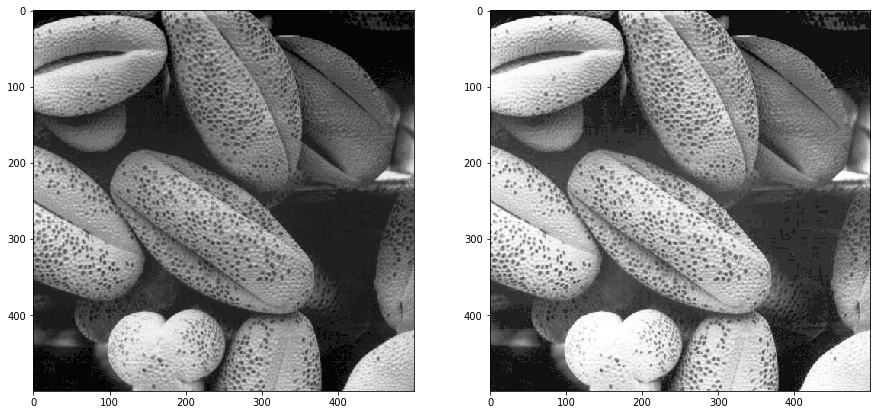


#### 问题1：提取RGB三个通道图像，计算其平均直方图结果，然后再进行均衡化；


```python
image = ["test/Fig6.30(01).bmp","test/Fig6.35(1).bmp","test/Fig6.35(3).bmp","test/Fig6.35(5).bmp","test/Fig6.37(a).bmp"]
stage = ["B","G","R"]
plt.figure(figsize=(15,15))
for i, element in enumerate(image):
    img2 = cv2.imread(element)
    img_2 = img2[:,:,[2,1,0]] 
    for j,img in enumerate(cv2.split(img_2)):
        plt.subplot(5, 3, 1 + i * 3 + j)
        plt.imshow(img,cmap = 'gray')
        plt.title(stage[j],color='blue') 
plt.show() 
```


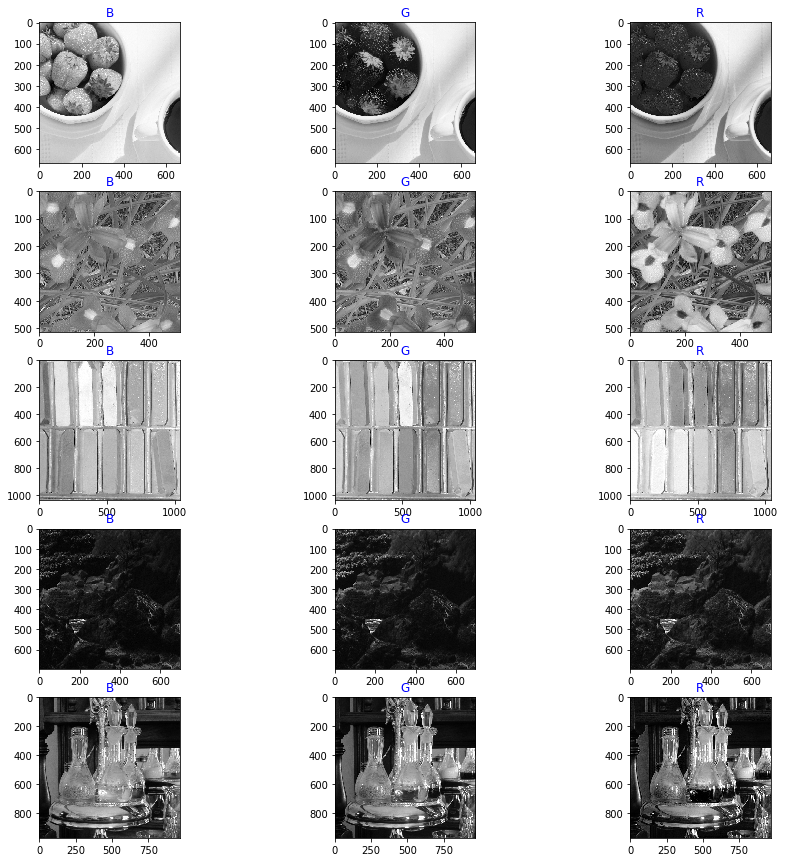


```python
image = ["test/Fig6.30(01).bmp","test/Fig6.35(1).bmp","test/Fig6.35(3).bmp","test/Fig6.35(5).bmp","test/Fig6.37(a).bmp"]
stage = ["RGB","B","G","R","Back2RGB"]
plt.figure(figsize=(15,15))
for i, element in enumerate(image):
    img2 = cv2.imread(element)
    img_2 = img2[:,:,[2,1,0]] 
    b,g,r = cv2.split(img_2)
    bequ = cv2.equalizeHist(b)
    gequ = cv2.equalizeHist(g)
    requ = cv2.equalizeHist(r)
    imgequ = cv2.merge((bequ, gequ, requ))
    images = [img_2,bequ, gequ, requ,imgequ]
    for j, img in  enumerate(images):
        plt.subplot(5, 5, 1 + i * 5 + j)
        plt.imshow(img,cmap = 'gray')
        plt.title(stage[j],color='blue') 
plt.show()
```


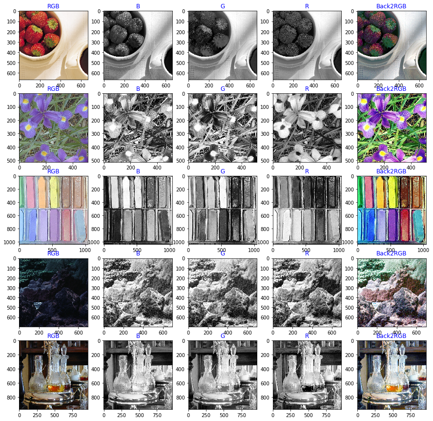


#### 问题2：RGB空转为HSI空间图像，对 I（亮度，Intensity）通道进行直方图均衡化，再转为RGB图像。


```python
def rgb2hsi(rgb_img):
    """
    这是将RGB彩色图像转化为HSI图像的函数
    :param rgm_img: RGB彩色图像
    :return: HSI图像
    """
    #保存原始图像的行列数
    row = np.shape(rgb_img)[0]
    col = np.shape(rgb_img)[1]
    #对原始图像进行复制
    hsi_img = rgb_img.copy()
    #对图像进行通道拆分
    B,G,R = cv2.split(rgb_img)
    #把通道归一化到[0,1]
    [B,G,R] = [ i/ 255.0 for i in ([B,G,R])]
    H = np.zeros((row, col))    #定义H通道
    I = (R + G + B) / 3.0       #计算I通道
    S = np.zeros((row,col))      #定义S通道
    for i in range(row):
        den = np.sqrt((R[i]-G[i])**2+(R[i]-B[i])*(G[i]-B[i]))
        thetha = np.arccos(0.5*(R[i]-B[i]+R[i]-G[i])/den)   #计算夹角
        h = np.zeros(col)               #定义临时数组
        #den>0且G>=B的元素h赋值为thetha
        h[B[i]<=G[i]] = thetha[B[i]<=G[i]]
        #den>0且G<=B的元素h赋值为thetha
        h[G[i]<B[i]] = 2*np.pi-thetha[G[i]<B[i]]
        #den<0的元素h赋值为0
        h[den == 0] = 0
        H[i] = h/(2*np.pi)      #弧度化后赋值给H通道
    #计算S通道
    for i in range(row):
        min = []
        #找出每组RGB值的最小值
        for j in range(col):
            arr = [B[i][j],G[i][j],R[i][j]]
            min.append(np.min(arr))
        min = np.array(min)
        #计算S通道
        S[i] = 1 - min*3/(R[i]+B[i]+G[i])
        #I为0的值直接赋值0
        S[i][R[i]+B[i]+G[i] == 0] = 0
    #扩充到255以方便显示，一般H分量在[0,2pi]之间，S和I在[0,1]之间
    hsi_img[:,:,0] = H*255
    hsi_img[:,:,1] = S*255
    hsi_img[:,:,2] = I*255
    return hsi_img

def hsi2rgb(hsi_img):
    """
    这是将HSI图像转化为RGB图像的函数
    :param hsi_img: HSI彩色图像
    :return: RGB图像
    """
    # 保存原始图像的行列数
    row = np.shape(hsi_img)[0]
    col = np.shape(hsi_img)[1]
    #对原始图像进行复制
    rgb_img = hsi_img.copy()
    #对图像进行通道拆分
    H,S,I = cv2.split(hsi_img)
    #把通道归一化到[0,1]
    [H,S,I] = [ i/ 255.0 for i in ([H,S,I])]
    R,G,B = H,S,I
    for i in range(row):
        h = H[i]*2*np.pi
        #H大于等于0小于120度时
        a1 = h >=0
        a2 = h < 2*np.pi/3
        a = a1 & a2         #第一种情况的花式索引
        tmp = np.cos(np.pi / 3 - h)
        b = I[i] * (1 - S[i])
        r = I[i]*(1+S[i]*np.cos(h)/tmp)
        g = 3*I[i]-r-b
        B[i][a] = b[a]
        R[i][a] = r[a]
        G[i][a] = g[a]
        #H大于等于120度小于240度
        a1 = h >= 2*np.pi/3
        a2 = h < 4*np.pi/3
        a = a1 & a2         #第二种情况的花式索引
        tmp = np.cos(np.pi - h)
        r = I[i] * (1 - S[i])
        g = I[i]*(1+S[i]*np.cos(h-2*np.pi/3)/tmp)
        b = 3 * I[i] - r - g
        R[i][a] = r[a]
        G[i][a] = g[a]
        B[i][a] = b[a]
        #H大于等于240度小于360度
        a1 = h >= 4 * np.pi / 3
        a2 = h < 2 * np.pi
        a = a1 & a2             #第三种情况的花式索引
        tmp = np.cos(5 * np.pi / 3 - h)
        g = I[i] * (1-S[i])
        b = I[i]*(1+S[i]*np.cos(h-4*np.pi/3)/tmp)
        r = 3 * I[i] - g - b
        B[i][a] = b[a]
        G[i][a] = g[a]
        R[i][a] = r[a]
    rgb_img[:,:,0] = B*255
    rgb_img[:,:,1] = G*255
    rgb_img[:,:,2] = R*255
    return rgb_img
```


```python
r2h_i = rgb2hsi(img_2)
```

```python
Intensity = r2h_i[:,:,2]

hist = np.bincount(Intensity.ravel(), minlength=256)#直方图
# plt.subplot(1, 2, 2)
plt.hist(img.ravel(), 256, [0, 256])
plt.title("hist")
Intensityequ = cv2.equalizeHist(Intensity)

backHSI = cv2.merge((r2h_i[:,:,0], r2h_i[:,:,1], Intensityequ))
backRGB = hsi2rgb(backHSI)
```


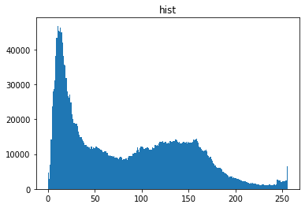


```python
image = ["test/Fig6.30(01).bmp","test/Fig6.35(1).bmp","test/Fig6.35(3).bmp","test/Fig6.35(5).bmp","test/Fig6.37(a).bmp"]
stage = ["RGB","HSI","Intensity","backHSI","back2RGB"]
plt.figure(figsize=(15,15))
for i,element in enumerate(image):
    images = []
    img2 = cv2.imread(element)
    img_2 = img2[:,:,[2,1,0]]
    images.append(img_2)
    
    r2h_i = rgb2hsi(img_2)
    images.append(r2h_i)
    
    Intensity = r2h_i[:,:,2]
    hist = np.bincount(Intensity.ravel(), minlength=256)#直方图
    
    Intensityequ = cv2.equalizeHist(Intensity)
    images.append(Intensityequ)
    
    backHSI = cv2.merge((r2h_i[:,:,0], r2h_i[:,:,1], Intensityequ))
    images.append(backHSI)
    
    backRGB = hsi2rgb(backHSI)
    images.append(backRGB)
    
    for j, img in enumerate(images):
        plt.subplot(5, 5, 1 + i*5 + j)
        plt.imshow(img)
        plt.title(stage[i],color='blue')
plt.show()   
```


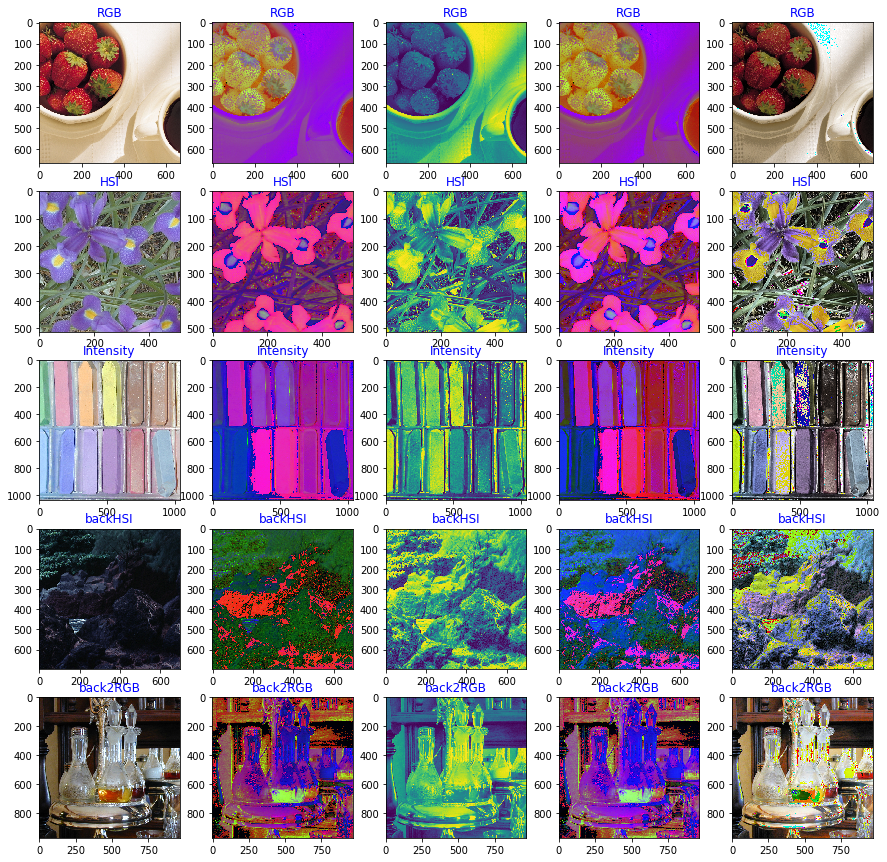


## 作业二：彩色图像的去噪
#### 问题1：对一副彩色图像分别添加高斯噪声和椒盐噪声，输出结果图像； 


```python
def sp_noise(image,prob):
    '''
    添加椒盐噪声
    prob:噪声比例 
    '''
    output = np.zeros(image.shape,np.uint8)
    thres = 1 - prob 
    for i in range(image.shape[0]):
        for j in range(image.shape[1]):
            rdn = random.random()
            if rdn < prob:
                output[i][j] = 0
            elif rdn > thres:
                output[i][j] = 255
            else:
                output[i][j] = image[i][j]
    return output

def gasuss_noise(image, mean=0, var=0.001):
    ''' 
        添加高斯噪声
        mean : 均值 
        var : 方差
    '''
    image = np.array(image/255, dtype=float)
    noise = np.random.normal(mean, var ** 0.5, image.shape)
    out = image + noise
    if out.min() < 0:
        low_clip = -1.
    else:
        low_clip = 0.
    out = np.clip(out, low_clip, 1.0)
    out = np.uint8(out*255)
    #cv.imshow("gasuss", out)
    return out

```


```python
image = ["test/Fig6.30(01).bmp","test/Fig6.35(1).bmp","test/Fig6.35(3).bmp","test/Fig6.35(5).bmp","test/Fig6.37(a).bmp"]
stage = ["origin","gasuss noise","Salt and pepper noise"]
plt.figure(figsize=(15,15))
for i, element in enumerate(image):
    img2 = cv2.imread(element)
    img_2 = img2[:,:,[2,1,0]]
    gasuss = gasuss_noise(img_2,var=0.01)
    Salt = sp_noise(img_2,0.01)
    images = [img_2,gasuss, Salt]
    for j, img in  enumerate(images):
        plt.subplot(5, 3, 1 + i * 3 + j)
        plt.imshow(img)
        plt.title(stage[j],color='blue') 
plt.show()
```


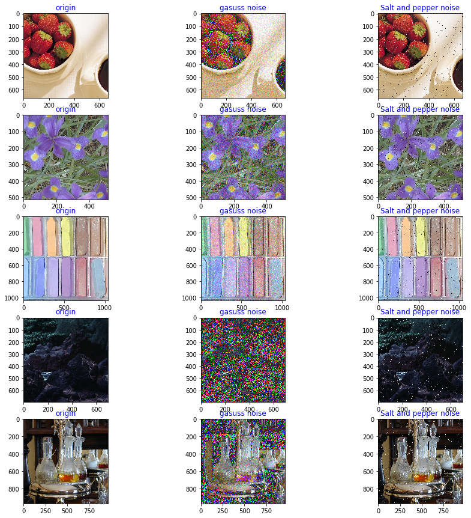

#### 问题2：采用K-NN均值滤波对二种噪声图像进行去噪，测试3组不同的参数，输出结果图像，并分析实验效果；

- 思路：将一个窗口区域中的像素计算平均值，然后将窗口中计算得到的均值设置为锚点上的像素值。

- 特点：该算法有优点在于效率高，思路简单。同样，缺点也很明显，计算均值会将图像中的边缘信息以及特征信息“模糊”掉，会丢失很多特征。

- 实现：使用如下卷积核即可。图像的边界部分采用padding操作处理。另外，得到的锚点像素值要进行归一化，即除以窗口尺寸大小。
  $$
  \text {kernel}=\left[\begin{array}{lll}{1} & {1} & {1} \\ {1} & {1} & {1} \\ {1} & {1} & {1}\end{array}\right]
  $$


```python
#均值模糊 : 去随机噪声有很好的去噪效果
#（1, 15）是垂直方向模糊，（15， 1）是水平方向模糊

image = ["test/Fig6.30(01).bmp","test/Fig6.35(1).bmp","test/Fig6.35(3).bmp","test/Fig6.35(5).bmp","test/Fig6.37(a).bmp"]
stage = ["origin","gasuss noise->K-NN mean","Salt and pepper noise->K-NN mean"]
plt.figure(figsize=(15,15))
for i, element in enumerate(image):
    img2 = cv2.imread(element)
    img_2 = img2[:,:,[2,1,0]]
    #高斯噪声->K-NN均值滤波
    gasuss = cv2.blur(gasuss_noise(img_2,var=0.01), (4, 4))
    #椒盐噪声->K-NN均值滤波
    Salt = cv2.blur(sp_noise(img_2,0.01), (4, 4))
    images = [img_2,gasuss, Salt]
    for j, img in  enumerate(images):
        plt.subplot(5, 3, 1 + i * 3 + j)
        plt.imshow(img)
        plt.title(stage[j],color='blue') 
plt.show()
```


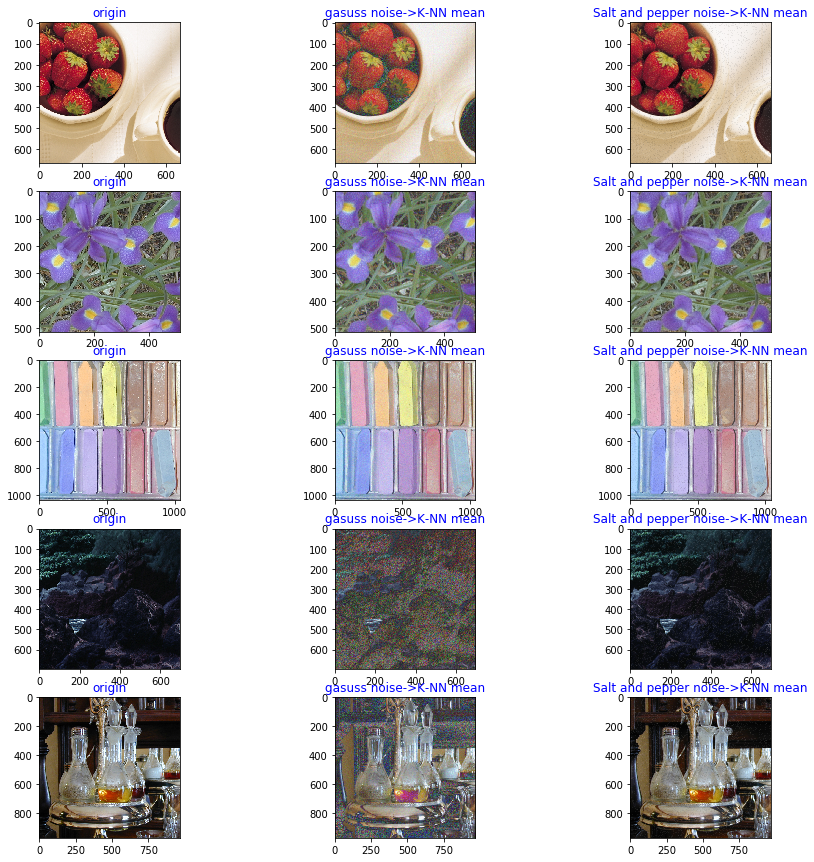

#### 问题3：采用K-NN中值滤波对二种噪声图像进行去噪，测试3组不同的参数，输出结果图像，并分析实验效果。

中值滤波是一种非线性滤波，在处理脉冲噪声以及**椒盐噪声**时效果极佳，能够有效的保护好图像的边缘信息。

- 思路：中值滤波的处理思路很简单，取卷积核当中所覆盖像素中的中值作为锚点的像素值即可。

- 实现：在计算中值的办法中，不使用排序，而是使用像素直方图，也就是记录像素值的哈希。首先设定阈值threshold，这个threshold就是窗口的中心位置，即ksize×ksize/2+1，kisze为窗口尺寸。

  每次在计算中值的过程中，从小到大累加像素直方图的值，如果该值大于等于，此时对应的像素值就是中值了。

  例如ksize=3的窗口如下：
  $$
  \left[\begin{array}{lll}{1} & {2} & {1} \\ {2} & {3} & {5} \\ {2} & {5} & {4}\end{array}\right]
  $$
  对该窗口中的值计算像素直方图如下，threshold=3×3/2+1=5
  1:2（表示像素值为1的有2个）
  2:3
  3:1
  4:1
  5:2

  因为2+3≥5，所以中值为2


```python
image = ["test/Fig6.30(01).bmp","test/Fig6.35(1).bmp","test/Fig6.35(3).bmp","test/Fig6.35(5).bmp","test/Fig6.37(a).bmp"]
stage = ["origin","gasuss noise->K-NN medianBlur","Salt and pepper noise->K-NN medianBlur"]
plt.figure(figsize=(15,15))
for i, element in enumerate(image):
    img2 = cv2.imread(element)
    img_2 = img2[:,:,[2,1,0]]
    #高斯噪声->K-NN均值滤波
    gasuss = cv2.medianBlur(gasuss_noise(img_2,var=0.01), 5)
    #椒盐噪声->K-NN均值滤波
    Salt = cv2.medianBlur(sp_noise(img_2,0.01), 5)
    images = [img_2,gasuss, Salt]
    for j, img in  enumerate(images):
        plt.subplot(5, 3, 1 + i * 3 + j)
        plt.imshow(img)
        plt.title(stage[j],color='blue') 
plt.show()
```


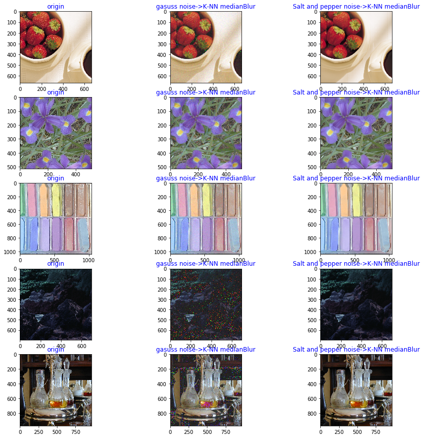


# 实验二：数字图像频域增强实验
## 作业一：彩色图像的频域滤波器
#### 问题1：采用高斯低通滤波器对彩色图像进行滤波操作, 取半径为5, 20, 50, 80和250, 分别输出空域和频域的结果图像。

- 二维高斯函数：

$$
h(x, y, \sigma)=\frac{1}{2 \pi \sigma^{2}} \exp \left(-\frac{x^{2}+y^{2}}{2 \sigma^{2}}\right)
$$

其中x,y是像素坐标，r是模糊半径，$\left(r^{2}=x^{2}+y^{2}\right), \sigma$是静态分布标准偏差。


```python
def GaussianLowFilter(image,d):
    f = np.fft.fft2(image)
    fshift = np.fft.fftshift(f)
    def make_transform_matrix(d):
        transfor_matrix = np.zeros(image.shape)
        center_point = tuple(map(lambda x:(x-1)/2,image.shape))
        for i in range(transfor_matrix.shape[0]):
            for j in range(transfor_matrix.shape[1]):
                def cal_distance(pa,pb):
                    from math import sqrt
                    dis = sqrt((pa[0]-pb[0])**2+(pa[1]-pb[1])**2)
                    return dis
                dis = cal_distance(center_point,(i,j))
                transfor_matrix[i,j] = np.exp(-(dis**2)/(2*(d**2)))
        return transfor_matrix
    d_matrix = make_transform_matrix(d)
    new_img = np.abs(np.fft.ifft2(np.fft.ifftshift(fshift*d_matrix)))
    return new_img
```


```python
size = [5,20,50,80,250];
name = ["test/Fig6.30(01).bmp","test/Fig6.35(1).bmp","test/Fig6.35(3).bmp","test/Fig6.35(5).bmp","test/Fig6.37(a).bmp"]
plt.figure(figsize=(15,15))

for j,element in enumerate(name):
    img2 = cv2.imread(element,0)
    for i, element1 in enumerate(size):
        img_blur = GaussianLowFilter(img2,element1)
        plt.subplot(5, 5, 1 + i + j * 5)
        plt.imshow(img_blur)
        plt.title('size: ' + str(element1))
plt.savefig("guss.png",dpi = 100)
plt.show()
```


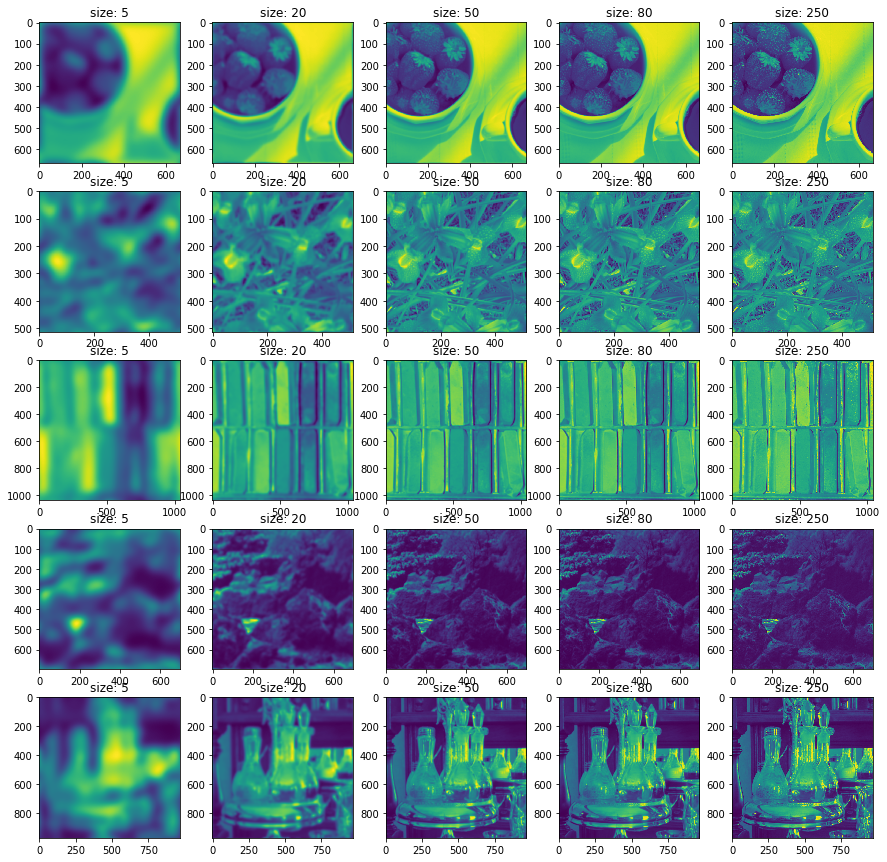

```python
def GaussianLowFilter(image,d):
    f = np.fft.fft2(image)
    fshift = np.fft.fftshift(f)
    def make_transform_matrix(d):
        transfor_matrix = np.zeros(image.shape)
        center_point = tuple(map(lambda x:(x-1)/2,image.shape))
        for i in range(transfor_matrix.shape[0]):
            for j in range(transfor_matrix.shape[1]):
                def cal_distance(pa,pb):
                    from math import sqrt
                    dis = sqrt((pa[0]-pb[0])**2+(pa[1]-pb[1])**2)
                    return dis
                dis = cal_distance(center_point,(i,j))
                #修改函数
                transfor_matrix[i,j] = 1-np.exp(-(dis**2)/(2*(d**2)))
        return transfor_matrix
    d_matrix = make_transform_matrix(d)
    new_img = np.abs(np.fft.ifft2(np.fft.ifftshift(fshift*d_matrix)))
    return new_img
```


```python
size = [5,20,50,80,250];
name = ["test/Fig6.30(01).bmp","test/Fig6.35(1).bmp","test/Fig6.35(3).bmp","test/Fig6.35(5).bmp","test/Fig6.37(a).bmp"]
plt.figure(figsize=(15,15))

for j,element in enumerate(name):
    img2 = cv2.imread(element,0)
    for i, element1 in enumerate(size):
        img_blur = GaussianLowFilter(img2,element1)
        plt.subplot(5, 5, 1 + i + j * 5)
        plt.imshow(img_blur)
        plt.title('size: ' + str(element1))
plt.savefig("guss.png",dpi = 100)
plt.show()
```


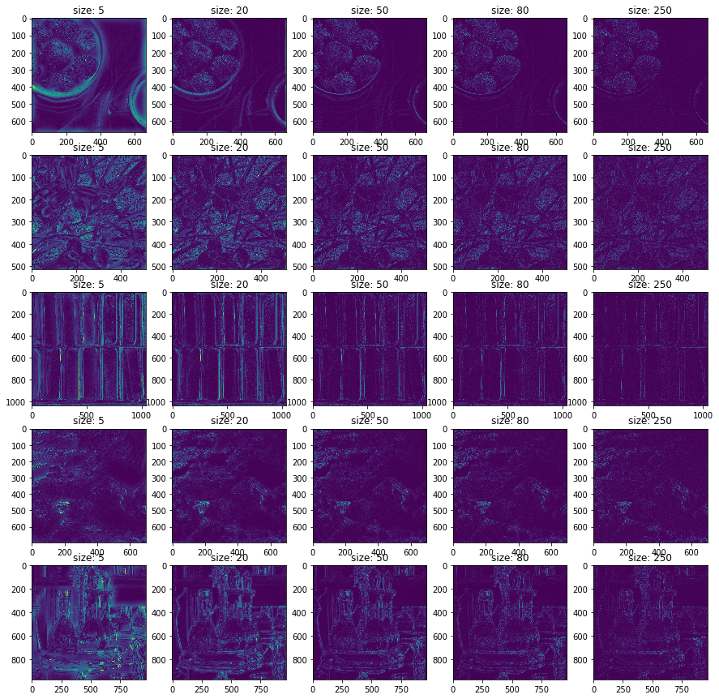


## 作业二: 灰度和彩色图像的快速傅立叶变换
#### 问题1：对输入的灰度和彩色图像进行快速傅立叶变换,显示频谱图;

- 傅立叶变换公式

$$
F(\omega)=\mathcal{F}[f(t)]=\int_{-\infty}^{\infty} f(t) e^{-i w t} d t
$$


```python
# 算法原理：
# 快速傅里叶变换的基本思想是把原始的N点序列，依次分解成一系列的短序列。

image = ["test/Fig6.30(01).bmp","test/Fig6.35(1).bmp","test/Fig6.35(3).bmp","test/Fig6.35(5).bmp","test/Fig6.37(a).bmp"]
stage = ["origin","Magnitude Spectrum"]
plt.figure(figsize=(15,15))
for i, element in enumerate(image):
    img2 = cv2.imread(element,0)
    
    # 灰度图快速傅立叶变换
    dft=cv2.dft(np.float32(img2),flags=cv2.DFT_COMPLEX_OUTPUT)
    dft_shift=np.fft.fftshift(dft)
    magnitude_spectrum = 20*np.log(cv2.magnitude(dft_shift[:,:,0],dft_shift[:,:,1]))
    
    images = [img2,magnitude_spectrum]
    for j, img in  enumerate(images):
        plt.subplot(5, 2, 1 + i * 2 + j)
        plt.imshow(img,cmap = 'gray')
        plt.title(stage[j],color='blue') 
plt.show()
```


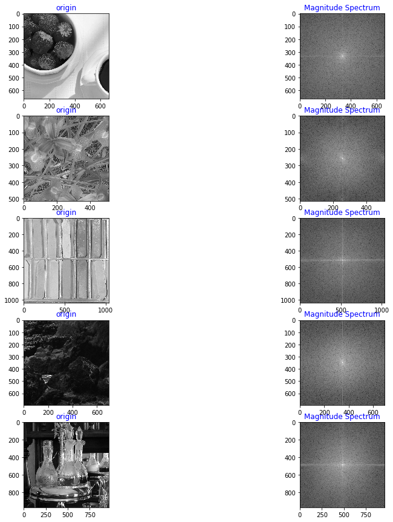


#### 问题2：进行逆变换,观察结果。


```python
# 算法原理：
# 将得到的频谱图进行逆变换，从频域转化为空间域。

image = ["test/Fig6.30(01).bmp","test/Fig6.35(1).bmp","test/Fig6.35(3).bmp","test/Fig6.35(5).bmp","test/Fig6.37(a).bmp"]
stage = ["origin","Magnitude Spectrum","reduction"]
plt.figure(figsize=(15,15))
for i, element in enumerate(image):
    img2 = cv2.imread(element,0)
    
    # 灰度图快速傅立叶变换
    dft=cv2.dft(np.float32(img2),flags=cv2.DFT_COMPLEX_OUTPUT)
    dft_shift=np.fft.fftshift(dft)
    magnitude_spectrum = 20*np.log(cv2.magnitude(dft_shift[:,:,0],dft_shift[:,:,1]))
    
    # 逆变换
    fshift=np.fft.ifftshift(dft_shift)
    img_back=cv2.idft(fshift)
    img_back=cv2.magnitude(img_back[:,:,0],img_back[:,:,1])
    
    images = [img2,magnitude_spectrum,img_back]
    for j, img in  enumerate(images):
        plt.subplot(5, 3, 1 + i * 3 + j)
        plt.imshow(img,cmap = 'gray')
        plt.title(stage[j],color='blue') 
plt.show()

# 分析：
# 经过快速傅里叶变换后的图片逆变换后图像的细节不会丢失，图像不会发生改变。
```


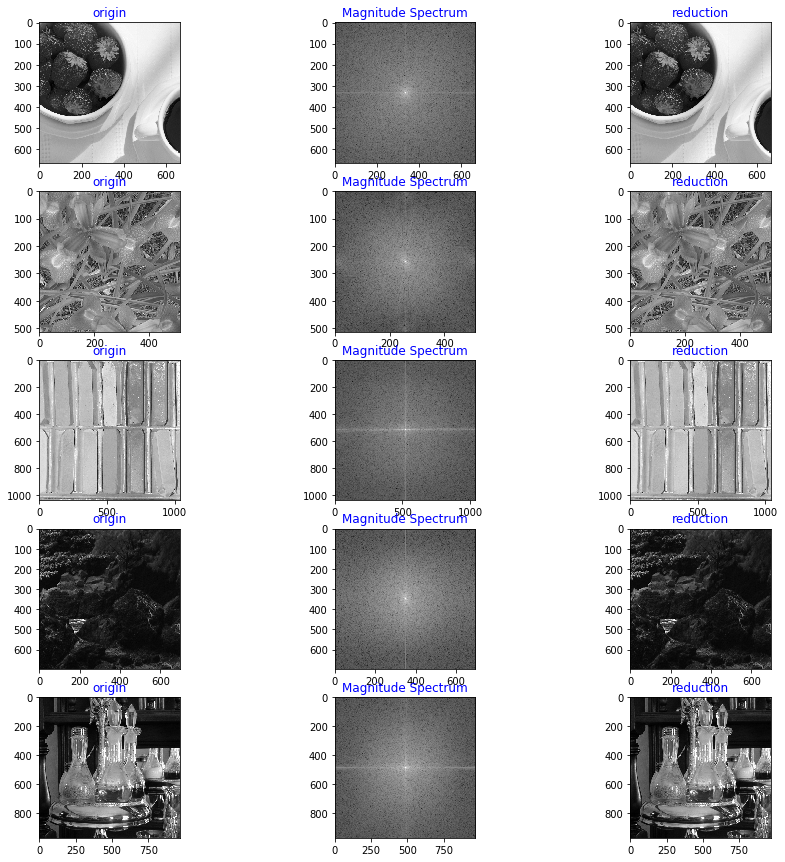


## 作业三：灰度和彩色图像的离散余弦变换
#### 问题1：对输入的灰度和彩色图像进行分块，每一块图像为8*8像素的大小。对分块图像进行离散余弦变换，输出频谱图（DCT系数）；

余弦变换实际上是傅立叶变换的实数部分。余弦变换主要用于图像的压缩。

由于实偶函数的傅立叶变换只含有余旋项，因此构造了一种实 数域的变换一.DCT变换。DCT变换的基本思想是将一个实函数对称延拓成一个实偶函数，实偶函数的傅立叶变换也必然是实偶函数。
$$
g(x)=\left\{\begin{array}{cc}{f\left(x-\frac{1}{2}\right),} & {x=\frac{1}{2}, \ldots, \frac{1}{2}+(N-1)} \\ {f\left(-x+\frac{1}{2}\right),} & {x=-\frac{1}{2}, \ldots,-\frac{1}{2}-(N-1)}\end{array}\right.
$$

- 一维离散余弦变换：

$$
\begin{array}{l}{F(u)=c(u) \sqrt{\frac{2}{N}} \sum_{x=0}^{N-1} f(x) \cos \frac{(2 x+1) u \pi}{2 N}} \\ {f(x)=\sqrt{\frac{2}{N}} \sum_{u=0}^{N-1} c(u) F(u) \cos \frac{(2 x+1) u \pi}{2 N}} \\ {c(u)=\left\{\begin{array}{ll}{\frac{1}{\sqrt{2}}} & {u=0} \\ {1} & {\text { otherwise }}\end{array}\right.}\end{array}
$$


```python
# 快速DCT变换补充大小
def dctpad(src):
    h, w = src.shape[:2]
    h1 = int((h / 8 + 0.5)) * 8
    w1 = int((w / 8 + 0.5)) * 8
    # 拷贝到补充的数组
    dft_A = np.zeros((h1, w1), dtype=np.float32)
    dft_A[:h, :w] = src
    return dft_A
```


```python
image = ["test/Fig3.10(b).bmp","test/Fig6.38(a).bmp","test/Fig3.37(a).bmp","test/Fig6.16(a).bmp","test/Fig2.21(a).bmp"]
stage = ["origin","8x8 DCT"]
plt.figure(figsize=(15,15))
for i, element in enumerate(image):
    img2 = cv2.imread(element,0)
    
    # 图片的高度和宽度
    h, w = img2.shape[:2]

    imgf = dctpad(img2)
    dct = np.zeros_like(imgf)
    imsize = imgf.shape
    # 8x8 DCT
    for x in range(0, imgf.shape[0], 8):
        for y in range(0, imgf.shape[1], 8):
            dct[x:(x + 8), y:(y + 8)] = cv2.dct(imgf[x:(x + 8), y:(y + 8)])
    
    images = [img2,dct]
    for j, img in  enumerate(images):
        plt.subplot(5, 2, 1 + i * 2 + j)
        if(j==1):
            plt.imshow(img,cmap = 'gray', vmax=np.max(dct) * 0.01, vmin=0)
        else:
            plt.imshow(img,cmap = 'gray')
        plt.title(stage[j],color='blue') 
plt.show()
```


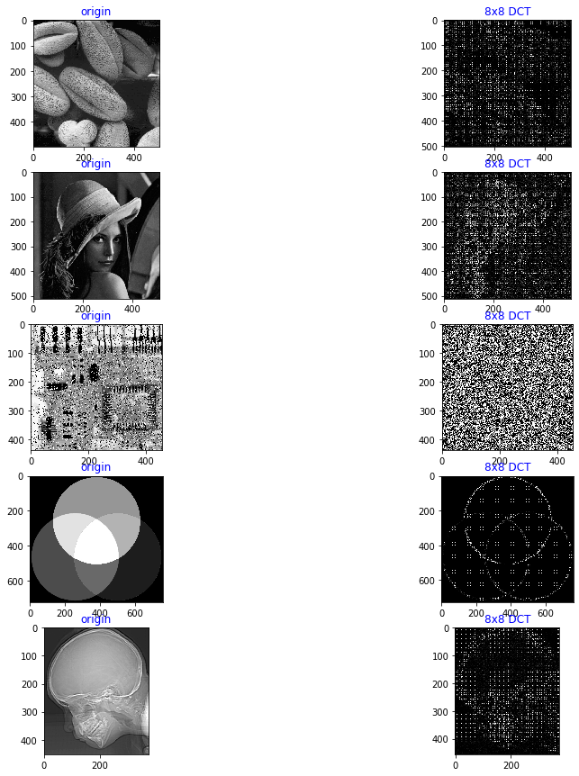


#### 问题2：尝试改变部分的DCT系数；


```python
# 算法原理：
# 阈值分割，舍弃高频系数（AC系数），保留低频信息（DC系数）。
image = ["test/Fig3.10(b).bmp","test/Fig6.38(a).bmp","test/Fig3.37(a).bmp","test/Fig6.16(a).bmp","test/Fig2.21(a).bmp"]
stage = ["8x8 DCT","thresh_cut 8x8 DCT"]
plt.figure(figsize=(15,15))
for i, element in enumerate(image):
    img2 = cv2.imread(element,0)
    
    # 图片的高度和宽度
    h, w = img2.shape[:2]

    imgf = dctpad(img2)
    dct = np.zeros_like(imgf)
    imsize = imgf.shape
    # 8x8 DCT
    for x in range(0, imgf.shape[0], 8):
        for y in range(0, imgf.shape[1], 8):
            dct[x:(x + 8), y:(y + 8)] = cv2.dct(imgf[x:(x + 8), y:(y + 8)])
    # 阈值分割，相当于量化
    thresh = 0.012
    dct_thresh = dct * (abs(dct) > (thresh * np.max(dct)))
    
    images = [dct,dct_thresh]
    percent_nonzeros = [np.sum(dct_thresh != 0.0) / (imsize[0] * imsize[1] * 1.0)]
    for j, img in  enumerate(images):
        plt.subplot(5, 2, 1 + i * 2 + j)
        plt.imshow(img,cmap = 'gray', vmax=np.max(dct) * 0.01, vmin=0)
        plt.title(stage[j],color='blue') 
        if(j%2==0):
            print("保留系数 %f%% " % (percent_nonzeros[j] * 100.0))
plt.show()

# 分析：
# 选取阈值为0.012，将每个小块的图像进行系数改变，舍去图像细节，减少图像数据量。
```

    保留系数 3.441515% 
    保留系数 5.880737% 
    保留系数 71.945774% 
    保留系数 2.111770% 
    保留系数 4.783735% 


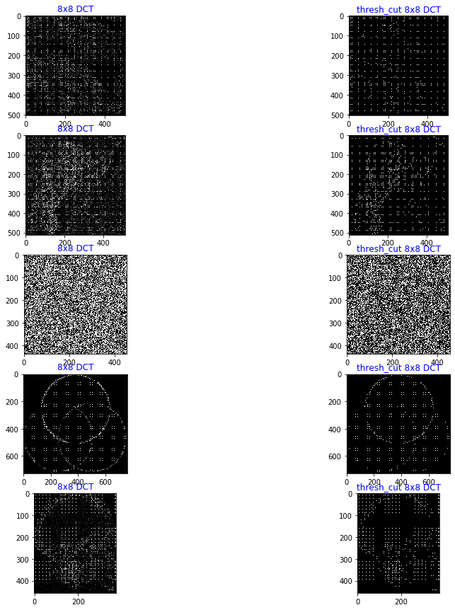


#### 问题3：通过离散余弦逆变换，还原出图像，观察与原图像之间的区别。


```python
# 算法原理：
# 对上述步骤得到的每个图像块进行IDCT变换，然后组合得到压缩后的图像。

image = ["test/Fig3.10(b).bmp","test/Fig6.38(a).bmp","test/Fig3.37(a).bmp","test/Fig6.16(a).bmp","test/Fig2.21(a).bmp"]
stage = ["Input Image","output Image"]
plt.figure(figsize=(15,15))
for i, element in enumerate(image):
    img2 = cv2.imread(element,0)
    
    # 图片的高度和宽度
    h, w = img2.shape[:2]

    imgf = dctpad(img2)
    dct = np.zeros_like(imgf)
    imsize = imgf.shape
    # 8x8 DCT
    for x in range(0, imgf.shape[0], 8):
        for y in range(0, imgf.shape[1], 8):
            dct[x:(x + 8), y:(y + 8)] = cv2.dct(imgf[x:(x + 8), y:(y + 8)])
    # 阈值分割，相当于量化
    thresh = 0.012
    dct_thresh = dct * (abs(dct) > (thresh * np.max(dct)))
        
    im_dct = np.zeros(imsize)
    # 8x8 IDCT
    for x in range(0, im_dct.shape[0], 8):
        for y in range(0, im_dct.shape[1], 8):
            im_dct[x:(x + 8), y:(y + 8)] = cv2.idct(dct_thresh[x:(x + 8), y:(y + 8)])
    
    images = [img2,im_dct]
    percent_nonzeros = [np.sum(dct_thresh != 0.0) / (imsize[0] * imsize[1] * 1.0)]
    for j, img in  enumerate(images):
        plt.subplot(5, 2, 1 + i * 2 + j)
        plt.imshow(img,cmap = 'gray')
        plt.title(stage[j],color='blue') 
plt.show()

# 分析：
# 经过逆变换后得到的压缩图像部分细节丢失，图像变得模糊，但是总体观感依旧不错，压缩质量很好。
```


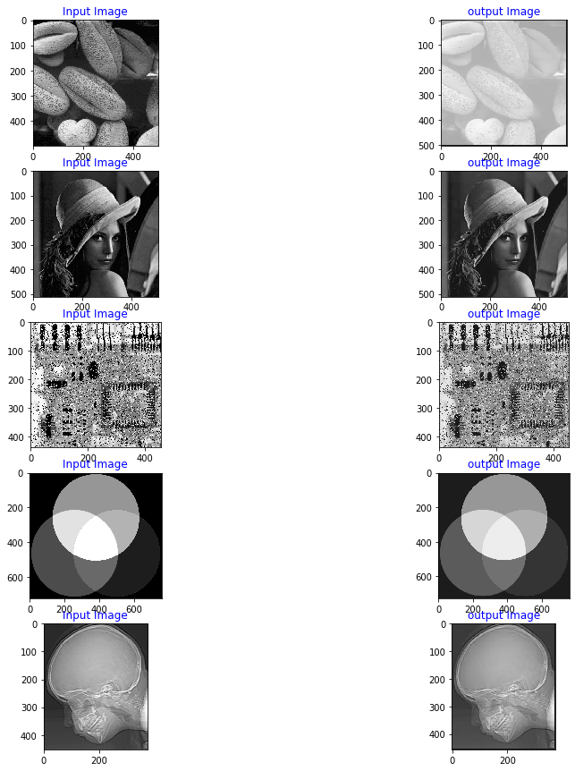


# 实验3： 数字图像分割与边缘检测实验
## 作业一：使用一阶和二阶检测算子（导数）进行图像的边缘检测。
Roberts算子、Prewitt算子、Sobel算子一阶导数算子的模板卷积


#### 问题1：编写程序实现一阶Sobel算子，进行图像的边缘提取；

Sobel算子为：
$$
\begin{aligned} \partial \mathrm{x}=\left(\mathrm{z}_{7}+2 \mathrm{z}_{8}+\mathrm{z}_{9}\right)-\left(\mathrm{z}_{1}+2 \mathrm{z}_{2}+\mathrm{z}_{3}\right) \\ \partial \mathrm{y}=\left(\mathrm{z}_{3}+2 \mathrm{z}_{6}+\mathrm{z}_{9}\right)-\left(\mathrm{z}_{1}+2 \mathrm{z}_{4}+\mathrm{z}_{7}\right) \\  \end{aligned}
$$
梯度值：
$$
\begin{aligned}  & \nabla \mathrm{f} \approx|\partial \mathrm{x}|+|\partial \mathrm{y}|  \end{aligned}
$$

- 使用与分析

1. 直接计算$\partial \mathrm{x}$和$\partial \mathrm{y}$可以检测到边的存在，以及从暗到亮，从亮到暗的变化

2. 仅计算|$\partial \mathrm{x}$|，产生最强的响应是正交  于x轴的边； |$\partial \mathrm{y}$|则是正交于y轴的边。

3. Soleb算子具有平滑效果，由于微分增强了噪音，这一点是特别引人注意的特性


```python
'''
Sobel算子
Sobel算子依然是一种过滤器，只是其是带有方向的。在OpenCV-Python中，
使用Sobel的算子的函数原型如下：
dst = cv2.Sobel(src, ddepth, dx, dy[, dst[, ksize[, scale[, delta[, borderType]]]]]) 
前四个是必须的参数：
第一个参数是需要处理的图像；
第二个参数是图像的深度，-1表示采用的是与原图像相同的深度。目标图像的深度必须大于等于原图像的深度；
dx和dy表示的是求导的阶数，0表示这个方向上没有求导，一般为0、1、2。
其后是可选的参数：
dst：结果图；
ksize是Sobel算子的大小，必须为1、3、5、7。
scale是缩放导数的比例常数，默认情况下没有伸缩系数；
delta是一个可选的增量，将会加到最终的dst中，同样，默认情况下没有额外的值加到dst中；
borderType是判断图像边界的模式。这个参数默认值为cv2.BORDER_DEFAULT。
'''

image = ["test/Fig6.30(01).bmp","test/Fig6.35(1).bmp","test/Fig6.35(3).bmp","test/Fig6.35(5).bmp","test/Fig6.37(a).bmp"]
stage = ["Input Image","output Image"]
plt.figure(figsize=(15,15))
for i, element in enumerate(image):
    img2 = cv2.imread(element,0)
    #coding=utf-8 
    x = cv2.Sobel(img2,cv2.CV_16S,1,0)
    y = cv2.Sobel(img2,cv2.CV_16S,0,1)
 
    absX = cv2.convertScaleAbs(x)# 转回uint8 
    absY = cv2.convertScaleAbs(y)
    Sobel = cv2.addWeighted(absX,0.5,absY,0.5,0)
    
    images = [img2,Sobel]
    for j, img in  enumerate(images):
        plt.subplot(5, 2, 1 + i * 2 + j)
        plt.imshow(img, cmap='gray')
        plt.title(stage[j],color='blue') 
plt.show()
```


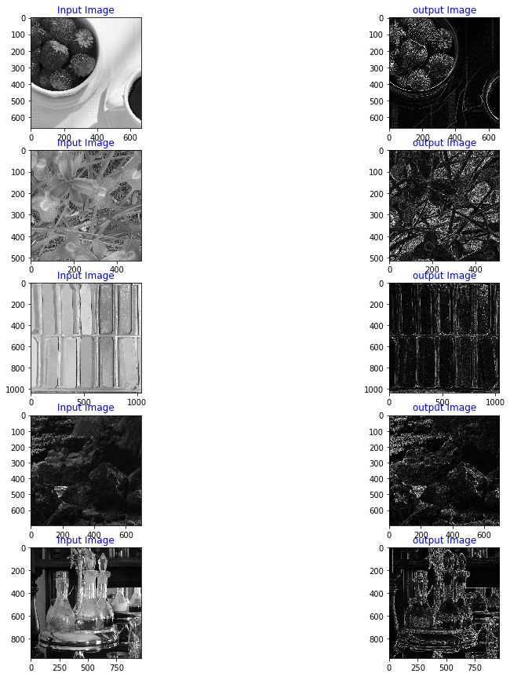


#### 问题2：编写程序实现一阶Prewitt算子，进行图像的边缘提取；


```python
image = ["test/Fig6.30(01).bmp","test/Fig6.35(1).bmp","test/Fig6.35(3).bmp","test/Fig6.35(5).bmp","test/Fig6.37(a).bmp"]
stage = ["Input Image","output Image"]
plt.figure(figsize=(15,15))
for i, element in enumerate(image):
    img2 = cv2.imread(element,0)
    #Prewitt算子
    kernelx = np.array([[1,1,1],[0,0,0],[-1,-1,-1]],dtype=int)
    kernely = np.array([[-1,0,1],[-1,0,1],[-1,0,1]],dtype=int)
    x = cv2.filter2D(img2, cv2.CV_16S, kernelx)
    y = cv2.filter2D(img2, cv2.CV_16S, kernely)
    #转uint8
    absX = cv2.convertScaleAbs(x)       
    absY = cv2.convertScaleAbs(y)    
    Prewitt = cv2.addWeighted(absX,0.5,absY,0.5,0)
    
    images = [img2,Prewitt]
    for j, img in  enumerate(images):
        plt.subplot(5, 2, 1 + i * 2 + j)
        plt.imshow(img, cmap='gray')
        plt.title(stage[j],color='blue') 
plt.show()
```


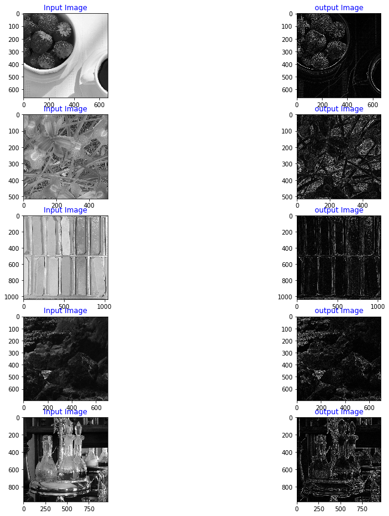


#### 问题3：编写程序实现一阶Roberts算子，进行图像的边缘提取；


```python
image = ["test/Fig6.30(01).bmp","test/Fig6.35(1).bmp","test/Fig6.35(3).bmp","test/Fig6.35(5).bmp","test/Fig6.37(a).bmp"]
stage = ["Input Image","output Image"]
plt.figure(figsize=(15,15))
for i, element in enumerate(image):
    img2 = cv2.imread(element,0)
    #Roberts算子
    kernelx = np.array([[-1,0],[0,1]], dtype=int)
    kernely = np.array([[0,-1],[1,0]], dtype=int)
    x = cv2.filter2D(img2, cv2.CV_16S, kernelx)
    y = cv2.filter2D(img2, cv2.CV_16S, kernely)
    #转uint8 
    absX = cv2.convertScaleAbs(x)      
    absY = cv2.convertScaleAbs(y)    
    Roberts = cv2.addWeighted(absX,0.5,absY,0.5,0)
    
    images = [img2,Roberts]
    for j, img in  enumerate(images):
        plt.subplot(5, 2, 1 + i * 2 + j)
        plt.imshow(img, cmap='gray')
        plt.title(stage[j],color='blue') 
plt.show()
```


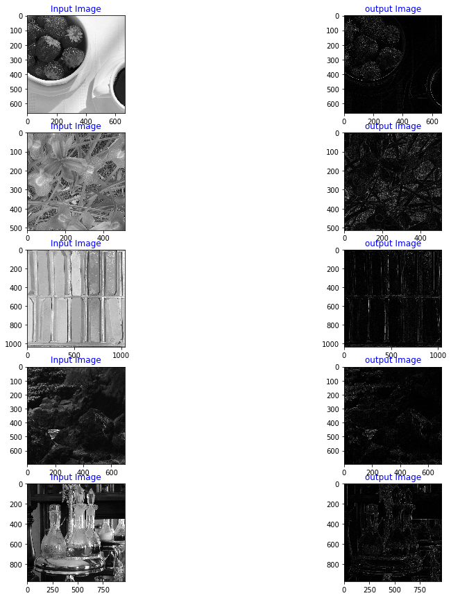

#### 问题4：编写程序实现二阶Laplacian算子（3*3），进行图像的边缘提取。

拉普拉斯算子可以用多种方式被表示为数字形式。

对于一个3x3的区域，经验上被推荐最多的形式是**：**
$$
\nabla^{2} \mathrm{f}=4 \mathrm{z}_{5}-\left(\mathrm{z}_{2}+\mathrm{z}_{4}+\mathrm{z}_{6}+\mathrm{z}_{8}\right)
$$


```python
image = ["test/Fig6.30(01).bmp","test/Fig6.35(1).bmp","test/Fig6.35(3).bmp","test/Fig6.35(5).bmp","test/Fig6.37(a).bmp"]
stage = ["Input Image","output Image"]
plt.figure(figsize=(15,15))
for i, element in enumerate(image):
    img2 = cv2.imread(element,0)

    laplacian=cv2.Laplacian(img2,cv2.CV_64F,ksize=11)
    
    images = [img2,laplacian]
    for j, img in  enumerate(images):
        plt.subplot(5, 2, 1 + i * 2 + j)
        plt.imshow(img, cmap='gray')
        plt.title(stage[j],color='blue') 
plt.show()
```


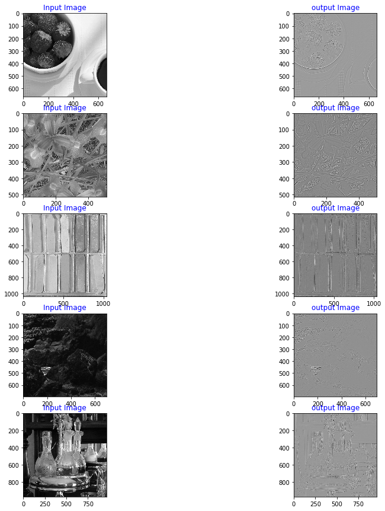


## 作业二： Hough线检测
#### 问题1：对作业一中边缘检测的结果，进行Hough线检测。

- Hough变换问题的提出

-在找出边界点集之后，需要连接，形成完整的边界图形描述

- Hough变换的基本思想

–对于边界上的n个点的点集，找出共线的点集和直线方程。

–对于任意两点的直线方程：y = ax + b，构造一个参数a，b的平面，从而有如下结论**：**

1. xy平面上的任意一条直线y = ax + b ，对应在参数ab平面上都有一个点
2. 过xy平面一个点(x,y)的所有直线，构成参数ab平面上的一条直线。
3. 如果点(x1,y1)与点(x2,y2)共线，那么这两点在参数ab平面上的直线将有一个交点
4. 在参数ab平面上相交直线最多的点，对应的xy平面上的直线就是我们的

- Hough变换算法实现

1. 由于垂直直线a,为无穷大，我们改用参数坐标形式： $x \cos \theta+\operatorname{ysin} \theta=\rho$

2. 参数平面为$\theta \rho$，对应不是直线而是正弦曲线

3. 使用交点累加器，或交点统计直方图，找出相交线段最多的参数空间的点

4. 然后找出该点对应的xy平面的直线线段


```python
image = ["test/Fig6.30(01).bmp","test/Fig6.35(1).bmp","test/Fig6.35(3).bmp","test/Fig6.35(5).bmp","test/Fig6.37(a).bmp"]
stage = ["Input Image","output Image"]
plt.figure(figsize=(15,15))
for i, element in enumerate(image):
    img2 = cv2.imread(element)
    #灰度图像 
    gray = cv2.cvtColor(img2,cv2.COLOR_BGR2GRAY)
    edges = cv2.Canny(gray,50,200)
    
    #hough transform
    lines = cv2.HoughLinesP(edges,1,np.pi/180,30,minLineLength=10,maxLineGap=50)
    #提取为二维
    lines1 = lines[:,0,:]
    for x1,y1,x2,y2 in lines1[:]: 
        cv2.line(img2,(x1,y1),(x2,y2),(0,0,255),1)
   
    images = [edges,img2]
    for j, img in  enumerate(images):
        plt.subplot(5, 2, 1 + i * 2 + j)
        if(j%2==0):
            plt.imshow(img, cmap='gray')
        else:
            img = img[:,:,[2,1,0]]
            plt.imshow(img)
        plt.title(stage[j],color='blue') 
plt.show()
```


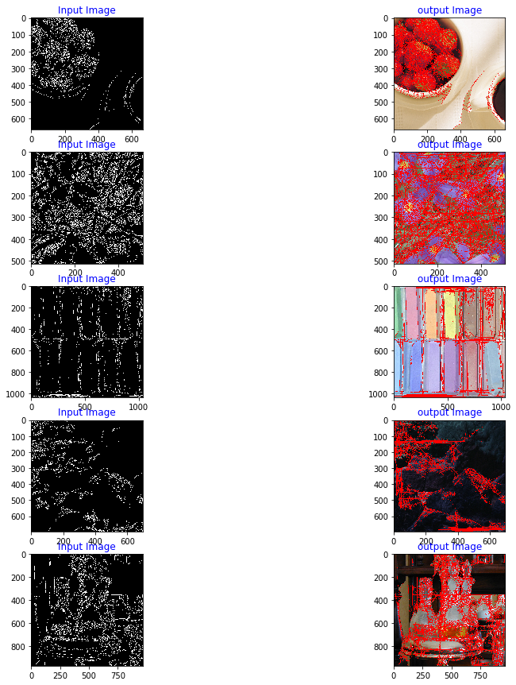

#### 问题2：调节参数，提取较长的边界。


```python
image = ["test/Fig6.30(01).bmp","test/Fig6.35(1).bmp","test/Fig6.35(3).bmp","test/Fig6.35(5).bmp","test/Fig6.37(a).bmp"]
stage = ["Input Image","output Image"]
plt.figure(figsize=(15,15))
for i, element in enumerate(image):
    img2 = cv2.imread(element)
    #灰度图像 
    gray = cv2.cvtColor(img2,cv2.COLOR_BGR2GRAY)
    edges = cv2.Canny(gray,50,200)
    
    #hough transform
    lines = cv2.HoughLinesP(edges,1,np.pi/180,30,minLineLength=60,maxLineGap=10)
    #提取为二维
    lines1 = lines[:,0,:]
    for x1,y1,x2,y2 in lines1[:]: 
        cv2.line(img2,(x1,y1),(x2,y2),(0,0,255),1)
   
    images = [edges,img2]
    for j, img in  enumerate(images):
        plt.subplot(5, 2, 1 + i * 2 + j)
        if(j%2==0):
            plt.imshow(img, cmap='gray')
        else:
            img = img[:,:,[2,1,0]]
            plt.imshow(img)
        plt.title(stage[j],color='blue') 
plt.show()
```


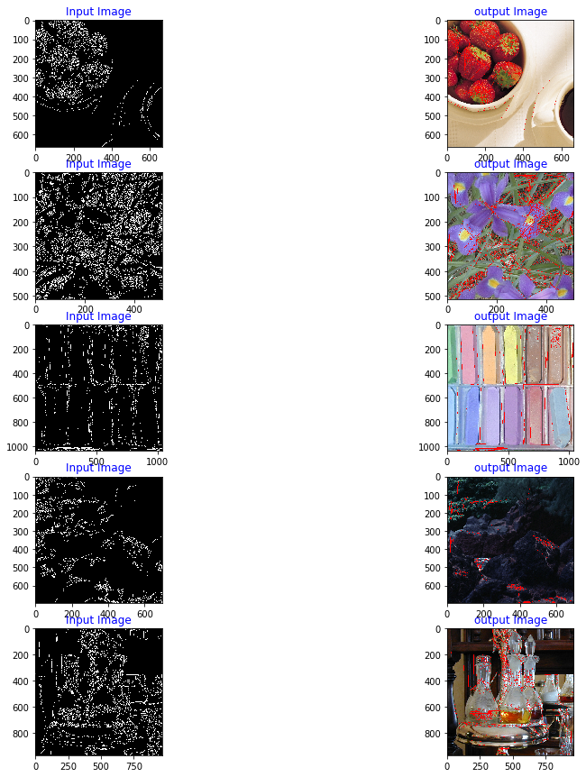


## 作业三：采用阈值处理方法进行图像分割
#### 问题1：参考相关文献，编写程序实现Otsu自动阈值法；


```python
#Ostu自适应阈值法实现
def Otsu(img):
    #设置初始阈值为0
    thres = 0
    #前景与背景的平均灰度设为0
    m1 = 0
    m2 = 0
    #前景与背景的灰度总值
    h_sum = 0
    c_sum = 0
    #前景与背景的像素个数
    n1 = 0
    n2 = 0
    #记录最大方差和当前阈值对应的方差值
    fmax = 0
    curr_f = 0
    #初始化灰度值统计数组
    ihist = [0] * 256
    height, width = img.shape
    n = height * width
    #统计灰度值
    for i in range(height):
        for j in range(width):
            ihist[img[i,j]] += 1
    #计算总灰度值
    for i in range(256):
        h_sum += i * ihist[i]
    #遍历所有灰度值，找到最大方差的阈值
    n1 = 0
    for k in range(255):
        n1 += ihist[k]
        n2 = n - n1
        if n1 == 0:
            continue
        n2 = n - n1
        if n2 == 0:
            break
        #计算前景的总灰度值
        c_sum += k*ihist[k]
        m1 = c_sum/n1
        m2 = (h_sum - c_sum)/n2
        curr_f = 1.0 * n1 * n2 * (m1-m2)**2
        #找到最大方差对应的灰度值
        if( curr_f > fmax ):
            fmax = curr_f
            thres = k
    return thres
#二值化图像
def Binarize(img, thres):
    return img > thres
```


```python
name = ["test/Fig6.30(01).bmp","test/Fig6.35(1).bmp","test/Fig6.35(3).bmp","test/Fig6.35(5).bmp","test/Fig6.37(a).bmp"]
plt.figure(figsize=(15,15))
for i, name in enumerate(name):
    img = cv2.imread(name,0)
    thres = Otsu(img)
    bw = Binarize(img, thres)
    plt.subplot(5,2,1 + i * 2),plt.imshow(img ,cmap='gray')
    plt.title('Input Image')
    plt.subplot(5,2,2 + i * 2),plt.imshow(bw ,cmap='gray')
    plt.title('Binary Image')
plt.show()
```


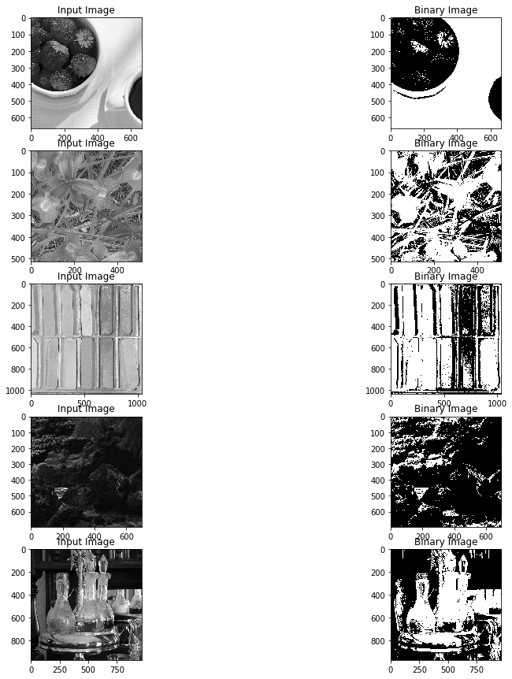


#### 问题2：实现直方图阈值法，具体方法为采用灰度直方图求双峰或多峰，选择两峰之间的谷底作为阈值，将图像转换为2值图像。


```python
 #统计像素值
def grayHist(image):
    rows,cols=image.shape
    grayHist=np.zeros([256],np.uint8)
    for r in range(rows):
        for c in range(cols):
            grayHist[image[r][c]]+=1
    return grayHist

#找到两峰之间的谷底
def threshLow(image):
    histogram=grayHist(image)
    #找到第一个峰值
    max_1=np.where(histogram==np.max(histogram))
    first=max_1[0][0]
    #找到第二个峰值
    measureDists=np.zeros([256],np.float32)
    for k in range(256):
        measureDists[k]=pow(k-first,2)*histogram[k]
    max_2=np.where(measureDists==np.max(measureDists))
    second=max_2[0][0]
    #找两个峰值之间的最小值对应的灰度值作为阈值
    thresh=0
    if first>second:
        temp=histogram[int(second):int(first)]
        min_t=np.where(temp==np.min(temp))
        thresh=min_t[0][0]+second+1
    else:
        temp=histogram[int(first):int(second)]
        min_t=np.where(temp==np.min(temp))
        thresh=min_t[0][0]+first+1

    return thresh
#二值化图像
def Binarize(img, thresh):
    return img > thresh
```


```python
name = ["test/Fig6.30(01).bmp","test/Fig6.35(1).bmp","test/Fig6.35(3).bmp","test/Fig6.35(5).bmp","test/Fig6.37(a).bmp"]
plt.figure(figsize=(15,15))
for i, name in enumerate(name):
    img = cv2.imread(name,0)
    thres = threshLow(img)
    bw = Binarize(img, thres)
    plt.subplot(5,2,1 + i * 2)
    plt.imshow(img ,cmap='gray')
    plt.title('Input Image')
    plt.subplot(5,2,2 + i * 2)
    plt.imshow(bw ,cmap='gray')
    plt.title('Binary Image')
plt.show()
```


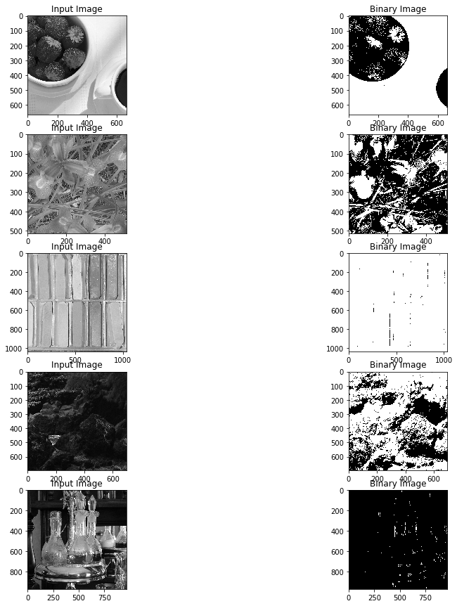


# 实验4 数字图像编码实验
## 作业一: 无损编码/压缩算法实验
#### 问题1: 实现行程编码压缩, 肉眼观察压缩效果，并计算原图和压缩以后的尺寸，计算压缩率并比较分析；

- 行程：具有相同灰度值的像素序列

- 编码思想：

  将一行中颜色值相同的相邻象素（行程）用一个计数值（行程的长度）和该颜色值（行程的灰度）来代替，从而去除像素冗余。


```python
def is_image_file(file_name):
    return any(
        file_name.endswith(extension)
        for extension in [".png", ".jpg", ".jpeg", '.PNG', '.JPG', '.JPEG'])


def default_loader(path):
    return cv2.imread(path, cv2.IMREAD_COLOR)


def gray_loader(path):
    return cv2.imread(path, cv2.IMREAD_GRAYSCALE)


def hsv_loader(path):
    img = cv2.imread(path, cv2.IMREAD_COLOR)
    return cv2.cvtColor(img, cv2.COLOR_BGR2HSV)


# Run Length Encoding 行程编码
class RLE:
    def __init__(self, path):
        self.path = path
        self.image_list = [x for x in listdir(path) if is_image_file(x)]
        self.image_list = sorted(self.image_list)

    def matrix2list(self, matirx):
        """ 按照行程编码样式将2维数组展开为一维数组 """
        mrows, mcols = matirx.shape[:2]
        mrows -= 1
        mcols -= 1
        mlen = min(mrows, mcols)

        rmatrix = []
        rmatrix.append(matirx[0][0])

        rmatrix.extend(self.first_encode(matirx, mlen))

        if mcols > mrows:
            rmatrix.extend(
                self.colmore_middle_encode(matirx, mlen, mcols, mrows))
            rmatrix.extend(self.colmore_last_encode(matirx, mlen, mcols,
                                                    mrows))
        else:
            rmatrix.extend(
                self.rowmore_middle_encode(matirx, mlen, mcols, mrows))
            rmatrix.extend(self.rowmore_last_encode(matirx, mlen, mcols,
                                                    mrows))

        rmatrix.append(matirx[-1][-1])

        return rmatrix

    def first_encode(self, matirx, mlen):
        rmatrix = []
        for len in range(1, mlen + 1):
            if (len % 2 == 1):
                for i in range(0, len + 1):
                    rmatrix.append(matirx[i][len - i])
            else:
                for i in range(0, len + 1):
                    rmatrix.append(matirx[len - i][i])
        return rmatrix

    def colmore_middle_encode(self, matirx, mlen, mcols, mrows):
        rmatrix = []
        if mlen % 2 == 0:
            for extra in range(mcols - mrows):
                if extra % 2 == 0:
                    for i in range(mlen + 1):
                        rmatrix.append(matirx[i][mlen - i + extra + 1])
                else:
                    for i in range(mlen + 1):
                        rmatrix.append(matirx[mlen - i][i + extra + 1])
        else:
            for extra in range(mcols - mrows):
                if extra % 2 == 1:
                    for i in range(mlen + 1):
                        rmatrix.append(matirx[i][mlen - i + extra + 1])
                else:
                    for i in range(mlen + 1):
                        rmatrix.append(matirx[mlen - i][i + extra + 1])
        return rmatrix

    def colmore_last_encode(self, matirx, mlen, mcols, mrows):
        rmatrix = []
        if mcols % 2 == 0:
            for len in range(0, mlen - 1):
                if len % 2 == 0:
                    for i in range(mlen - len):
                        rmatrix.append(
                            matirx[mlen - (mlen - 1 - len - i)][mlen - i +
                                                                mcols - mrows])
                else:
                    for i in range(mlen - len):
                        rmatrix.append(matirx[mlen -
                                              i][mlen - (mlen - 1 - len - i) +
                                                 mcols - mrows])
        else:
            for len in range(0, mlen - 1):
                if len % 2 == 1:
                    for i in range(mlen - len):
                        rmatrix.append(
                            matirx[mlen - (mlen - 1 - len - i)][mlen - i +
                                                                mcols - mrows])
                else:
                    for i in range(mlen - len):
                        rmatrix.append(matirx[mlen -
                                              i][mlen - (mlen - 1 - len - i) +
                                                 mcols - mrows])
        return rmatrix

    def rowmore_middle_encode(self, matirx, mlen, mcols, mrows):
        rmatrix = []
        if mlen % 2 == 0:
            for extra in range(mrows - mcols):
                if extra % 2 == 1:
                    for i in range(mlen + 1):
                        rmatrix.append(matirx[mlen - i + extra + 1][i])
                else:
                    for i in range(mlen + 1):
                        rmatrix.append(matirx[i + extra + 1][mlen - i])
        else:
            for extra in range(mrows - mcols):
                if extra % 2 == 0:
                    for i in range(mlen + 1):
                        rmatrix.append(matirx[mlen - i + extra + 1][i])
                else:
                    for i in range(mlen + 1):
                        rmatrix.append(matirx[i + extra + 1][mlen - i])

        return rmatrix

    def rowmore_last_encode(self, matirx, mlen, mcols, mrows):
        rmatrix = []
        if mrows % 2 == 0:
            for len in range(0, mlen - 1):
                if len % 2 == 0:
                    for i in range(mlen - len):
                        rmatrix.append(matirx[mlen - (mlen - 1 - len - i) +
                                              mrows - mcols][mlen - i])
                else:
                    for i in range(mlen - len):
                        rmatrix.append(matirx[mlen - i + mrows -
                                              mcols][mlen -
                                                     (mlen - 1 - len - i)])
        else:
            for len in range(0, mlen - 1):
                if len % 2 == 1:
                    for i in range(mlen - len):
                        rmatrix.append(matirx[mlen - (mlen - 1 - len - i) +
                                              mrows - mcols][mlen - i])
                else:
                    for i in range(mlen - len):
                        rmatrix.append(matirx[mlen - i + mrows -
                                              mcols][mlen -
                                                     (mlen - 1 - len - i)])
        return rmatrix

    def encode(self, lst):
        lst_encode = np.array([(len(list(group)), name)
                               for name, group in groupby(lst)])
        return lst_encode.flatten()

    def decode(self, lst_encode):
        lst = []
        for i in range(0, len(lst_encode), 2):
            print(lst_encode[i])
            length = int(lst_encode[i])
            for j in range(length):
                lst.append(lst_encode[i + 1])
        return lst

    def test(self):
        img3 = np.array(range(1, 9 + 1)).reshape(3, 3)
        img5 = np.array(range(1, 25 + 1)).reshape(5, 5)
        img4 = np.array(range(1, 16 + 1)).reshape(4, 4)

        img = np.array([[5, 4, 1, 2], [4, 3, 2, 1], [3, 3, 2, 1], [2, 3, 1,
                                                                   0]])

        col_img46 = np.array(range(1, 24 + 1)).reshape(4, 6)
        col_img45 = np.array(range(1, 20 + 1)).reshape(4, 5)
        col_img35 = np.array(range(1, 15 + 1)).reshape(3, 5)

        row_img53 = np.array(range(1, 15 + 1)).reshape(5, 3)
        row_img54 = np.array(range(1, 20 + 1)).reshape(5, 4)
        row_img64 = np.array(range(1, 24 + 1)).reshape(6, 4)
        # code = self.encode(self.matrix2list(col_img))
        # print(self.decode(code))

        print(self.matrix2list(row_img64))

    def compress(self, index):
        try:
            image_path = os.path.join(self.path, self.image_list[index - 1])
        except:
            print("ERROR！ 并不包含你想要进行RGB处理的这张图片")
        else:
            image_name = re.findall(r'(.+?)\.', self.image_list[index - 1])

            image = default_loader(image_path)

            size = sys.getsizeof((image.flatten()))

            print("Image {}:".format(index))

            print("Origin Image's Size is {:.2f} KB.".format(size / 1024))

            [b, g, r] = cv2.split(image)

            r_b = self.encode(self.matrix2list(b)).astype(np.uint8)
            r_g = self.encode(self.matrix2list(g)).astype(np.uint8)
            r_r = self.encode(self.matrix2list(r)).astype(np.uint8)

            # # 通过打印下面的语句，可以证明最终的存储比例超过200%，是因为对于
            # # 多维度图片的每个维度通道新建不同的数组进行保存的时候，开辟新数组
            # # 空间导致的过大的存储消耗，与压缩算法本身无关。
            # print(b.flatten().shape, r_b.shape)
            # print(g.flatten().shape, r_g.shape)
            # print(r.flatten().shape, r_r.shape)
            # print(sys.getsizeof(np.array([])))

            r_size = sys.getsizeof((r_b)) + sys.getsizeof(
                (r_g)) + sys.getsizeof((r_r))

            print(
                "After Run Length Encoding Image's Size is  {:.2f} KB.\nCompressed Image's size is {:.2%} of Origin Image."
                .format(r_size / 1024, r_size / size))

            # print("Origin Image's Array Size is {} .".format(
            #     len(image.flatten())))
            # print(
            #     "After Run Length Encoding Image's Array Size is  {} .\nCompressed Image's Array size is {:%} of Origin Image."
            #     .format(
            #         len(r_b) + len(r_g) + len(r_r),
            #         (len(r_b) + len(r_g) + len(r_r)) / len(image.flatten())))

            print()
```


```python
rle = RLE("test")
print(rle.image_list)
```

    ['1.jpg']

```python
rle.compress(0)
```

    Image 0:
    Origin Image's Size is 765.09 KB.
    After Run Length Encoding Image's Size is  963.85 KB.
    Compressed Image's size is 125.98% of Origin Image.

#### 问题2: 实现哈夫曼压缩, 肉眼观察压缩效果，并计算原图和压缩以后的尺寸，计算压缩率并比较分析；

- 基本思想：

  通过减少编码冗余来达到压缩的目的。

  统计符号的出现概率，建立一个概率统计表

  - 将最常出现(概率大的)的符号用最短的编码，

  - 最少出现的符号用最长的编码。


```python
class HuffmanLetter:
    def __init__(self, letter, freq):
        self.letter = letter
        self.freq = freq
        self.bitstring = ""

    def __repr__(self):
        return f"{self.letter}"


class HuffmanTreeNode:
    def __init__(self, freq, left, right):
        self.freq = freq
        self.left = left
        self.right = right

class Huffman:
    """
    Huffman coding compress for rgb image,
    using variable-length binary replace fixed-length coding
    to reduce image size.
    """
    def __init__(self, path):
        self.path = path
        self.image_list = [x for x in listdir(path) if is_image_file(x)]
        self.image_list = sorted(self.image_list)

    def byte_cut(self, image):
        """
        Split the image according to the length of the Byte (8 bits).
        """
        image_list = image.flatten()
        chars = {}
        for c in image_list:
            chars[c] = chars[c] + 1 if c in chars.keys() else 1
        return sorted([HuffmanLetter(c, f) for c, f in chars.items()],
                      key=lambda l: l.freq)

    def build_tree(self, letters):
        """
        Build huffman tree structure according to original character segment.
        """
        while len(letters) > 1:
            left = letters.pop(0)
            right = letters.pop(0)
            total_freq = left.freq + right.freq
            node = HuffmanTreeNode(total_freq, left, right)
            letters.append(node)
            letters.sort(key=lambda l: l.freq)
        return letters[0]

    def traverse_tree(self, root, bitstring):
        """
        Re-encoding according to the huffman tree structure, 
        getting huffman code.
        """
        if type(root) is HuffmanLetter:
            root.bitstring = bitstring
            return [root]
        letters = []
        letters += self.traverse_tree(root.left, bitstring + "0")
        letters += self.traverse_tree(root.right, bitstring + "1")
        return letters

    def test(self):
        test_image = np.array(np.random.randint(0, 25, size=[5, 5]))
        print(test_image.flatten())
        letters_list = self.byte_cut(test_image)
        print(letters_list)
        root = self.build_tree(letters_list)
        letters = self.traverse_tree(root, "")

        dict = {}
        for letter in letters:
            dict[letter.letter] = letter.bitstring
        # print(dict)

        compress = ""
        for bs in test_image.flatten():
            compress += dict[bs]
            # print(bs)
            # print(dict[bs])

        # for c in test_image:
        #     compress += letter.bitstring

        print(sys.getsizeof(test_image.flatten()))
        print(sys.getsizeof(compress))

    def huffman_change(self, image):
        letters_list = self.byte_cut(image)
        root = self.build_tree(letters_list)
        letters = self.traverse_tree(root, "")

        dict = {}
        for letter in letters:
            dict[letter.letter] = letter.bitstring

        compress = ""
        for bs in image.flatten():
            compress += dict[bs]

        return compress, dict

    def compress(self, index):
        try:
            image_path = os.path.join(self.path, self.image_list[index - 1])
        except:
            print("ERROR！ 并不包含你想要进行RGB处理的这张图片")
        else:
            image_name = re.findall(r'(.+?)\.', self.image_list[index - 1])

            image = default_loader(image_path)

            size = sys.getsizeof((image.flatten()))

            print("Image {}:".format(index))

            print("Origin Image's Size is {:.2f} KB.".format(size / 1024))

            [b, g, r] = cv2.split(image)

            r_b, r_b_dict = self.huffman_change(b)
            r_g, r_g_dict = self.huffman_change(g)
            r_r, r_r_dict = self.huffman_change(r)

            r = []
            r.append(r_b)
            r.append(r_g)
            r.append(r_r)

            # print(r)

            r_size = sys.getsizeof(r)
            r_dict_size = sys.getsizeof(r_b_dict) + sys.getsizeof(
                r_g_dict) + sys.getsizeof(r_r_dict)
            r_size_all = r_size + r_dict_size

            print("After Huffman Encoding Image's Size is  {:.2f} KB.\
                    \nCompressed Image's Huffman coding size is {:.2f} KB.\
                    \nCompressed Image's Huffman coding dictonary size is {:.2f} KB.\
                    \nCompressed Image's size is {:.2%} of Origin Image.".
                  format(r_size_all / 1024, r_size / 1024, r_dict_size / 1024,
                         r_size_all / size))

            print()
```


```python
huffman = Huffman("test")
print(huffman.image_list)
```

    ['1.jpg']

```python
huffman.compress(0)
```

    Image 0:
    Origin Image's Size is 765.09 KB.
    After Huffman Encoding Image's Size is  27.43 KB.                    
    Compressed Image's Huffman coding size is 0.10 KB.                    
    Compressed Image's Huffman coding dictonary size is 27.33 KB.                    
    Compressed Image's size is 3.59% of Origin Image.

#### 问题3: 实现一维无损预测压缩, 肉眼观察压缩效果，并计算原图和压缩以后的尺寸，计算压缩率并比较分析.

- 预测编码：根据数据在时间和空间上的相关性，根据统计模型利用已有样本对新样本进行预测

- 线性预测的编码思想

1. 去除像素冗余。

2. 认为相邻像素的信息有冗余。当前像素值可以用以前的像素值来获得。

3. 用当前像素值$f_n$，通过预测器得到一个预测值$\hat{f}_{n}=\text {round}\left(\sum_{i=1}^{m} a_{i} f_{n-i}\right)$，对当前值和预测值求差$e_{n}=f_{n}-\hat{f}_{n}$，对差编码，作为压缩数据流中的下一个元素。


```python
class PredictCode:
    """
    Linear prediction coding
    """
    def __init__(self, path):
        self.path = path
        self.image_list = [x for x in listdir(path) if is_image_file(x)]
        self.image_list = sorted(self.image_list)

    def predict_f(self, x):
        """
        Prediction function: y = x
        """
        return x

    def matrix2list(self, matirx):
        """ 按照行程编码样式将2维数组展开为一维数组 """
        mrows, mcols = matirx.shape[:2]
        mrows -= 1
        mcols -= 1
        mlen = min(mrows, mcols)

        rmatrix = []
        rmatrix.append(matirx[0][0])

        rmatrix.extend(self.first_encode(matirx, mlen))

        if mcols > mrows:
            rmatrix.extend(
                self.colmore_middle_encode(matirx, mlen, mcols, mrows))
            rmatrix.extend(self.colmore_last_encode(matirx, mlen, mcols,
                                                    mrows))
        else:
            rmatrix.extend(
                self.rowmore_middle_encode(matirx, mlen, mcols, mrows))
            rmatrix.extend(self.rowmore_last_encode(matirx, mlen, mcols,
                                                    mrows))

        rmatrix.append(matirx[-1][-1])

        return rmatrix

    def first_encode(self, matirx, mlen):
        rmatrix = []
        for len in range(1, mlen + 1):
            if (len % 2 == 1):
                for i in range(0, len + 1):
                    rmatrix.append(matirx[i][len - i])
            else:
                for i in range(0, len + 1):
                    rmatrix.append(matirx[len - i][i])
        return rmatrix

    def colmore_middle_encode(self, matirx, mlen, mcols, mrows):
        rmatrix = []
        if mlen % 2 == 0:
            for extra in range(mcols - mrows):
                if extra % 2 == 0:
                    for i in range(mlen + 1):
                        rmatrix.append(matirx[i][mlen - i + extra + 1])
                else:
                    for i in range(mlen + 1):
                        rmatrix.append(matirx[mlen - i][i + extra + 1])
        else:
            for extra in range(mcols - mrows):
                if extra % 2 == 1:
                    for i in range(mlen + 1):
                        rmatrix.append(matirx[i][mlen - i + extra + 1])
                else:
                    for i in range(mlen + 1):
                        rmatrix.append(matirx[mlen - i][i + extra + 1])
        return rmatrix

    def colmore_last_encode(self, matirx, mlen, mcols, mrows):
        rmatrix = []
        if mcols % 2 == 0:
            for len in range(0, mlen - 1):
                if len % 2 == 0:
                    for i in range(mlen - len):
                        rmatrix.append(
                            matirx[mlen - (mlen - 1 - len - i)][mlen - i +
                                                                mcols - mrows])
                else:
                    for i in range(mlen - len):
                        rmatrix.append(matirx[mlen -
                                              i][mlen - (mlen - 1 - len - i) +
                                                 mcols - mrows])
        else:
            for len in range(0, mlen - 1):
                if len % 2 == 1:
                    for i in range(mlen - len):
                        rmatrix.append(
                            matirx[mlen - (mlen - 1 - len - i)][mlen - i +
                                                                mcols - mrows])
                else:
                    for i in range(mlen - len):
                        rmatrix.append(matirx[mlen -
                                              i][mlen - (mlen - 1 - len - i) +
                                                 mcols - mrows])
        return rmatrix

    def rowmore_middle_encode(self, matirx, mlen, mcols, mrows):
        rmatrix = []
        if mlen % 2 == 0:
            for extra in range(mrows - mcols):
                if extra % 2 == 1:
                    for i in range(mlen + 1):
                        rmatrix.append(matirx[mlen - i + extra + 1][i])
                else:
                    for i in range(mlen + 1):
                        rmatrix.append(matirx[i + extra + 1][mlen - i])
        else:
            for extra in range(mrows - mcols):
                if extra % 2 == 0:
                    for i in range(mlen + 1):
                        rmatrix.append(matirx[mlen - i + extra + 1][i])
                else:
                    for i in range(mlen + 1):
                        rmatrix.append(matirx[i + extra + 1][mlen - i])

        return rmatrix

    def rowmore_last_encode(self, matirx, mlen, mcols, mrows):
        rmatrix = []
        if mrows % 2 == 0:
            for len in range(0, mlen - 1):
                if len % 2 == 0:
                    for i in range(mlen - len):
                        rmatrix.append(matirx[mlen - (mlen - 1 - len - i) +
                                              mrows - mcols][mlen - i])
                else:
                    for i in range(mlen - len):
                        rmatrix.append(matirx[mlen - i + mrows -
                                              mcols][mlen -
                                                     (mlen - 1 - len - i)])
        else:
            for len in range(0, mlen - 1):
                if len % 2 == 1:
                    for i in range(mlen - len):
                        rmatrix.append(matirx[mlen - (mlen - 1 - len - i) +
                                              mrows - mcols][mlen - i])
                else:
                    for i in range(mlen - len):
                        rmatrix.append(matirx[mlen - i + mrows -
                                              mcols][mlen -
                                                     (mlen - 1 - len - i)])
        return rmatrix

    def predict(self, image):
        # Using RLE to improve prediction coding efficiency.
        image_list = self.matrix2list(image)
        predict_list = []
        update_list = []
        predict_list.append(image_list[0])
        update_list.append(0)
        for c in image_list[1:]:
            pred = self.predict_f(predict_list[-1])
            e = c - pred
            predict_list.append(pred)
            update_list.append(e)
        return np.int8(predict_list), np.int8(update_list)

    def test(self):
        test_image = np.array(np.random.randint(0, 25, size=[5, 5]))
        predict_list, update_list = self.predict(test_image)
        print(predict_list)
        print(predict_list)

        print(sys.getsizeof(test_image.flatten()))
        # print(sys.getsizeof(predict_list))
        print(sys.getsizeof(update_list))

    def compress(self, index):
        try:
            image_path = os.path.join(self.path, self.image_list[index - 1])
        except:
            print("ERROR！ 并不包含你想要进行RGB处理的这张图片")
        else:
            image_name = re.findall(r'(.+?)\.', self.image_list[index - 1])

            image = default_loader(image_path)

            size = sys.getsizeof((image.flatten()))

            print("Image {}:".format(index))

            print("Origin Image's Size is {:.2f} KB.".format(size / 1024))

            [b, g, r] = cv2.split(image)

            r_b_pred, r_b_update = self.predict(b)
            r_g_pred, r_g_update = self.predict(g)
            r_r_pred, r_r_update = self.predict(r)

            r = []
            r.append(r_b_update)
            r.append(r_g_update)
            r.append(r_r_update)

            # print(r_b_update)
            # print(r)

            r_size = sys.getsizeof(r)

            print("After Predict Encoding Image's Size is  {:.2f} KB.\
                    \nCompressed Image's size is {:.2%} of Origin Image.".
                  format(r_size / 1024, r_size / size))

            print()
```


```python
predictCode = PredictCode("test")
print(predictCode.image_list)
```

    ['1.jpg']

```python
predictCode.compress(0)
```

    Image 0:
    Origin Image's Size is 765.09 KB.


    /Users/wxy/opt/anaconda3/lib/python3.7/site-packages/ipykernel_launcher.py:158: RuntimeWarning: overflow encountered in ubyte_scalars


    After Predict Encoding Image's Size is  0.10 KB.                    
    Compressed Image's size is 0.01% of Origin Image.


## 作业二: 有损压缩/压缩算法实验

* **step1. JPEG压缩离散余弦变换**

执行反向离散余弦变换。离散余弦变换（DCT）是以下公式定义的频率变换之一。
$$
\begin{array}{l}{0 \leq u, v<T} \\ {F(u, v)=\frac{2}{T} C(u) C(v) \sum_{y=0}^{T-1} \sum_{x=0}^{T-1} I(x, y) \cos \left(\frac{(2 x+1) u \pi}{2 T}\right) \cos \left(\frac{(2 y+1) v \pi}{2 T}\right)} \\ {C(u)=\left\{\begin{array}{ll}{\frac{1}{\sqrt{2}}} & {\text { if } u=0} \\ {1} & {\text { else }}\end{array}\right.}\end{array}\\
$$
\\
离散余弦逆变换（IDCT）是离散余弦变换的逆（解码），由以下公式定义。在此，K是确定恢复期间分辨率提高多少的参数。当K = T时，所有DCT系数都被使用，因此IDCT之后的分辨率最大，但是，当K为1或2时，用于还原的信息量（DCT系数）减少，因此分辨率降低。通过适当设置，可以减小图像容量.
$$
\begin{array}{l}{1 \leq K \leq T} \\ {f(x, y)=\frac{2}{T} \sum_{u=0}^{K-1} \sum_{v=0}^{K-1} C(u) C(v) F(u, v) \cos \left(\frac{(2 x+1) u \pi}{2 T}\right) \cos \left(\frac{(2 y+1) v \pi}{2 T}\right)} \\ {C(u)=\left\{\begin{array}{ll}{\frac{1}{\sqrt{2}}} & {\text { if } u=0} \\ {1} & {\text { else }}\end{array}\right.}\end{array}
$$


```python
# DFT hyper-parameters
K, L = 128, 128
channel = 3

# bgr -> gray
def bgr2gray(img):
	gray = 0.2126 * img[..., 2] + 0.7152 * img[..., 1] + 0.0722 * img[..., 0]
	return gray


# DFT
def dft(img):
	# Prepare DFT coefficient
	G = np.zeros((L, K, channel), dtype=np.complex)

	# prepare processed index corresponding to original image positions
	x = np.tile(np.arange(W), (H, 1))
	y = np.arange(H).repeat(W).reshape(H, -1)

	# dft
	for c in range(channel):
		for l in range(L):
			for k in range(K):
				G[l, k, c] = np.sum(img[..., c] * np.exp(-2j * np.pi * (x * k / K + y * l / L))) / np.sqrt(K * L)
				#for n in range(N):
				#    for m in range(M):
				#        v += gray[n, m] * np.exp(-2j * np.pi * (m * k / M + n * l / N))
				#G[l, k] = v / np.sqrt(M * N)

	return G

# IDFT
def idft(G):
	# prepare out image
	H, W, _ = G.shape
	out = np.zeros((H, W, channel), dtype=np.float32)

	# prepare processed index corresponding to original image positions
    
    
	x = np.tile(np.arange(W), (H, 1))
	y = np.arange(H).repeat(W).reshape(H, -1)

	# idft
	for c in range(channel):
		for l in range(H):
			for k in range(W):
				out[l, k, c] = np.abs(np.sum(G[..., c] * np.exp(2j * np.pi * (x * k / W + y * l / H)))) / np.sqrt(W * H)

	# clipping
	out = np.clip(out, 0, 255)
	out = out.astype(np.uint8)

	return out


# BPF
def bpf(G, ratio1=0.1, ratio2=0.5):
	H, W, _ = G.shape	

	# transfer positions
	_G = np.zeros_like(G)
	_G[:H//2, :W//2] = G[H//2:, W//2:]
	_G[:H//2, W//2:] = G[H//2:, :W//2]
	_G[H//2:, :W//2] = G[:H//2, W//2:]
	_G[H//2:, W//2:] = G[:H//2, :W//2]

	# get distance from center (H / 2, W / 2)
	x = np.tile(np.arange(W), (H, 1))
	y = np.arange(H).repeat(W).reshape(H, -1)

	# make filter
	_x = x - W // 2
	_y = y - H // 2
	r = np.sqrt(_x ** 2 + _y ** 2)
	mask = np.ones((H, W), dtype=np.float32)
	mask[(r < (W // 2 * ratio1)) | (r > (W // 2 * ratio2))] = 0

	mask = np.repeat(mask, channel).reshape(H, W, channel)

	# filtering
	_G *= mask

	# reverse original positions
	G[:H//2, :W//2] = _G[H//2:, W//2:]
	G[:H//2, W//2:] = _G[H//2:, :W//2]
	G[H//2:, :W//2] = _G[:H//2, W//2:]
	G[H//2:, W//2:] = _G[:H//2, :W//2]

	return G
```


```python
# Read image
img = cv2.imread("test/1.jpg")
H, W, C = img.shape

# Gray scale
gray = bgr2gray(img)

# DFT
G = dft(img)

# BPF
G = bpf(G, ratio1=0.1, ratio2=0.5)

# IDFT
out = idft(G)

plt.subplot(121),plt.imshow(img ,cmap='gray')
plt.title('Input Image')
plt.subplot(122),plt.imshow(out ,cmap='gray')
plt.title('Output Image')
plt.show()
```


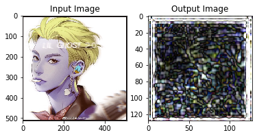


* **step2. JPEG压缩DCT +量化**

量化DCT系数并用IDCT恢复。还要比较当时的图像容量。

量化DCT系数是用于编码为jpeg图像的技术。

量化是对每个预定片段的值进行近似取整的操作，并且是类似于下限，上限，下限等的计算。

在JPEG图像中，DCT系数根据以下所示的量化表进行量化。该量化表取自jpeg组织的规范。在量化中，将8x8系数除以Q并四舍五入。之后，乘以Q。IDCT使用所有系数。


```python
# DCT hyoer-parameter
T = 8
K = 4
channel = 3

# DCT weight
def DCT_w(x, y, u, v):
    cu = 1.
    cv = 1.
    if u == 0:
        cu /= np.sqrt(2)
    if v == 0:
        cv /= np.sqrt(2)
    theta = np.pi / (2 * T)
    return (( 2 * cu * cv / T) * np.cos((2*x+1)*u*theta) * np.cos((2*y+1)*v*theta))

# DCT
def dct(img):
    H, W, _ = img.shape

    F = np.zeros((H, W, channel), dtype=np.float32)

    for c in range(channel):
        for yi in range(0, H, T):
            for xi in range(0, W, T):
                for v in range(T):
                    for u in range(T):
                        for y in range(T):
                            for x in range(T):
                                F[v+yi, u+xi, c] += img[y+yi, x+xi, c] * DCT_w(x,y,u,v)

    return F


# IDCT
def idct(F):
    H, W, _ = F.shape

    out = np.zeros((H, W, channel), dtype=np.float32)

    for c in range(channel):
        for yi in range(0, H, T):
            for xi in range(0, W, T):
                for y in range(T):
                    for x in range(T):
                        for v in range(K):
                            for u in range(K):
                                out[y+yi, x+xi, c] += F[v+yi, u+xi, c] * DCT_w(x,y,u,v)

    out = np.clip(out, 0, 255)
    out = np.round(out).astype(np.uint8)

    return out

# Quantization
def quantization(F):
    H, W, _ = F.shape

    Q = np.array(((16, 11, 10, 16, 24, 40, 51, 61),
                (12, 12, 14, 19, 26, 58, 60, 55),
                (14, 13, 16, 24, 40, 57, 69, 56),
                (14, 17, 22, 29, 51, 87, 80, 62),
                (18, 22, 37, 56, 68, 109, 103, 77),
                (24, 35, 55, 64, 81, 104, 113, 92),
                (49, 64, 78, 87, 103, 121, 120, 101),
                (72, 92, 95, 98, 112, 100, 103, 99)), dtype=np.float32)

    for ys in range(0, H, T):
        for xs in range(0, W, T):
            for c in range(channel):
                F[ys: ys + T, xs: xs + T, c] =  np.round(F[ys: ys + T, xs: xs + T, c] / Q) * Q

    return F


# MSE
def MSE(img1, img2):
    H, W, _ = img1.shape
    mse = np.sum((img1 - img2) ** 2) / (H * W * channel)
    return mse

# PSNR
def PSNR(mse, vmax=255):
    return 10 * np.log10(vmax * vmax / mse)

# bitrate
def BITRATE():
    return 1. * T * K * K / T / T
```


```python
# Read image
img = cv2.imread("test/Fig6.38(a).bmp").astype(np.float32)

# DCT
F = dct(img)

# quantization
F = quantization(F)

# IDCT
out = idct(F)

# MSE
mse = MSE(img, out)

# PSNR
psnr = PSNR(mse)

# bitrate
bitrate = BITRATE()

print("MSE:", mse)
print("PSNR:", psnr)
print("bitrate:", bitrate)
```

    MSE: 18.466482798258465
    PSNR: 35.46696175052246
    bitrate: 2.0

```python
cv2.waitKey(0)
cv2.imwrite("out.jpg", out)
```


    True


```python
plt.subplot(121),plt.imshow(img ,cmap='gray')
plt.title('Input Image :')
plt.subplot(122),plt.imshow(out ,cmap='gray')
plt.title('PSNR(35)bitrate(2) :')
plt.show()
```

    Clipping input data to the valid range for imshow with RGB data ([0..1] for floats or [0..255] for integers).


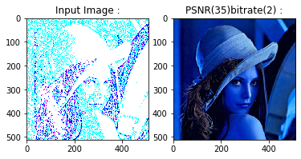


* **step3.JPEG 压缩——第三步：YCbCr 色彩空间**
在YCbCr颜色形式中，通过将Y乘以0.7来加深对比度。

YCbCr彩色系统是一种将图像分解为代表亮度的Y，亮度和蓝色电平之间的差Cb以及亮度和红色电平之间的Cr的表达方法。

在JPEG转换中使用。

从RGB到YCbCr的转换如下。

$$
Y = 0.299 * R + 0.5870 * G + 0.114 * B \\
Cb = -0.1687 * R - 0.3313 * G + 0.5 * B + 128 \\\
Cr = 0.5 * R - 0.4187 * G - 0.0813 * B + 128
$$
从YCbCr到RGB的转换如下。
$$
R = Y + (Cr - 128) * 1.402\\
G = Y - (Cb - 128) * 0.3441 - (Cr - 128) * 0.7139\\\
B = Y + (Cb - 128) * 1.7718
$$


```python
channel = 3

# BGR -> Y Cb Cr
def BGR2YCbCr(img):
    H, W, _ = img.shape

    ycbcr = np.zeros([H, W, 3], dtype=np.float32)

    ycbcr[..., 0] = 0.2990 * img[..., 2] + 0.5870 * img[..., 1] + 0.1140 * img[..., 0]
    ycbcr[..., 1] = -0.1687 * img[..., 2] - 0.3313 * img[..., 1] + 0.5 * img[..., 0] + 128.
    ycbcr[..., 2] = 0.5 * img[..., 2] - 0.4187 * img[..., 1] - 0.0813 * img[..., 0] + 128.

    return ycbcr

# Y Cb Cr -> BGR
def YCbCr2BGR(ycbcr):
    H, W, _ = ycbcr.shape

    out = np.zeros([H, W, channel], dtype=np.float32)
    out[..., 2] = ycbcr[..., 0] + (ycbcr[..., 2] - 128.) * 1.4020
    out[..., 1] = ycbcr[..., 0] - (ycbcr[..., 1] - 128.) * 0.3441 - (ycbcr[..., 2] - 128.) * 0.7139
    out[..., 0] = ycbcr[..., 0] + (ycbcr[..., 1] - 128.) * 1.7718

    out = np.clip(out, 0, 255)
    out = out.astype(np.uint8)

    return out
```


```python
# Read image
img = cv2.imread("test/Fig6.38(a).bmp")

# bgr -> Y Cb Cr
ycbcr = BGR2YCbCr(img)

# process
ycbcr[..., 0] *= 0.7

# YCbCr > RGB
out = YCbCr2BGR(ycbcr)

plt.subplot(121),plt.imshow(img ,cmap='gray')
plt.title('Input Image')
plt.subplot(122),plt.imshow(out ,cmap='gray')
plt.title('YCbCr2BGR Image')
plt.show()
```


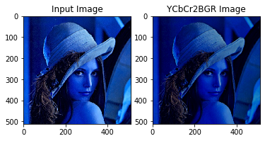


```python
cv2.waitKey(0)
cv2.imwrite("7out.jpg", out)
```


    True

* **step4.PEG压缩YCbCr + DCT +量化**

更改为YCbCr色彩系统DCT，使用量化表Q1，Q2量化Y，使用Q2量化Cb和Cr，并使用IDCT恢复图像。同时比较图像容量。


    1.将RGB转换为YCbCr
    2.YCbCr转DCT
    3.量化DCT
    4.量化IDCT
    5.将IDCT YCbCr转换为RGB


```python
# DCT hyoer-parameter
T = 8
K = 8
channel = 3


# BGR -> Y Cb Cr
def BGR2YCbCr(img):
    H, W, _ = img.shape

    ycbcr = np.zeros([H, W, 3], dtype=np.float32)

    ycbcr[..., 0] = 0.2990 * img[..., 2] + 0.5870 * img[..., 1] + 0.1140 * img[..., 0]
    ycbcr[..., 1] = -0.1687 * img[..., 2] - 0.3313 * img[..., 1] + 0.5 * img[..., 0] + 128.
    ycbcr[..., 2] = 0.5 * img[..., 2] - 0.4187 * img[..., 1] - 0.0813 * img[..., 0] + 128.

    return ycbcr

# Y Cb Cr -> BGR
def YCbCr2BGR(ycbcr):
    H, W, _ = ycbcr.shape

    out = np.zeros([H, W, channel], dtype=np.float32)
    out[..., 2] = ycbcr[..., 0] + (ycbcr[..., 2] - 128.) * 1.4020
    out[..., 1] = ycbcr[..., 0] - (ycbcr[..., 1] - 128.) * 0.3441 - (ycbcr[..., 2] - 128.) * 0.7139
    out[..., 0] = ycbcr[..., 0] + (ycbcr[..., 1] - 128.) * 1.7718

    out = np.clip(out, 0, 255)
    out = out.astype(np.uint8)

    return out


# DCT weight
def DCT_w(x, y, u, v):
    cu = 1.
    cv = 1.
    if u == 0:
        cu /= np.sqrt(2)
    if v == 0:
        cv /= np.sqrt(2)
    theta = np.pi / (2 * T)
    return (( 2 * cu * cv / T) * np.cos((2*x+1)*u*theta) * np.cos((2*y+1)*v*theta))

# DCT
def dct(img):
    H, W, _ = img.shape
    F = np.zeros((H, W, channel), dtype=np.float32)

    for c in range(channel):
        for yi in range(0, H, T):
            for xi in range(0, W, T):
                for v in range(T):
                    for u in range(T):
                        for y in range(T):
                            for x in range(T):
                                F[v+yi, u+xi, c] += img[y+yi, x+xi, c] * DCT_w(x,y,u,v)

    return F


# IDCT
def idct(F):
    H, W, _ = F.shape

    out = np.zeros((H, W, channel), dtype=np.float32)

    for c in range(channel):
        for yi in range(0, H, T):
            for xi in range(0, W, T):
                for y in range(T):
                    for x in range(T):
                        for v in range(K):
                            for u in range(K):
                                out[y+yi, x+xi, c] += F[v+yi, u+xi, c] * DCT_w(x,y,u,v)

    out = np.clip(out, 0, 255)
    out = np.round(out).astype(np.uint8)

    return out

# Quantization
def quantization(F):
    H, W, _ = F.shape

    Q = np.array(((16, 11, 10, 16, 24, 40, 51, 61),
                (12, 12, 14, 19, 26, 58, 60, 55),
                (14, 13, 16, 24, 40, 57, 69, 56),
                (14, 17, 22, 29, 51, 87, 80, 62),
                (18, 22, 37, 56, 68, 109, 103, 77),
                (24, 35, 55, 64, 81, 104, 113, 92),
                (49, 64, 78, 87, 103, 121, 120, 101),
                (72, 92, 95, 98, 112, 100, 103, 99)), dtype=np.float32)

    for ys in range(0, H, T):
        for xs in range(0, W, T):
            for c in range(channel):
                F[ys: ys + T, xs: xs + T, c] =  np.round(F[ys: ys + T, xs: xs + T, c] / Q) * Q

    return F


# JPEG without Hufman coding
def JPEG(img):
    # BGR -> Y Cb Cr
    ycbcr = BGR2YCbCr(img)

    # DCT
    F = dct(ycbcr)

    # quantization
    F = quantization(F)

    # IDCT
    ycbcr = idct(F)

    # Y Cb Cr -> BGR
    out = YCbCr2BGR(ycbcr)

    return out


# MSE
def MSE(img1, img2):
    H, W, _ = img1.shape
    mse = np.sum((img1 - img2) ** 2) / (H * W * channel)
    return mse

# PSNR
def PSNR(mse, vmax=255):
    return 10 * np.log10(vmax * vmax / mse)

# bitrate
def BITRATE():
    return 1. * T * K * K / T / T
```


```python
# Read image
img = cv2.imread("test/Fig6.38(a).bmp")

# JPEG
out = JPEG(img)

# MSE
mse = MSE(img, out)

# PSNR
psnr = PSNR(mse)

# bitrate
bitrate = BITRATE()

print("MSE:", mse)
print("PSNR:", psnr)
print("bitrate:", bitrate)
```

    MSE: 15.766873677571615
    PSNR: 36.153347727501725
    bitrate: 8.0

```python
plt.subplot(121),plt.imshow(img ,cmap='gray')
plt.title('Input Image :')
plt.subplot(122),plt.imshow(out ,cmap='gray')
plt.title('JPEG(img) :')
plt.show()
```


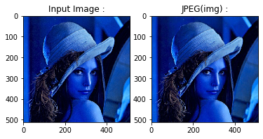


```python
cv2.waitKey(0)
cv2.imwrite("out.jpg", out)
```


    True
